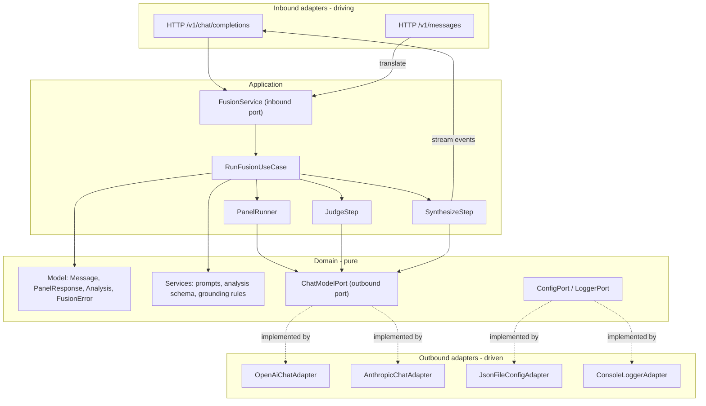

# Fusion Local Proxy

A local server that looks like a single model to clients but internally runs **fan-out to a panel -> judge -> streamed synthesis** against configurable backends. Structured with a hexagonal (ports-and-adapters) DDD layout: a pure domain, an application layer that orchestrates use cases through ports, and infrastructure adapters on both the driving (HTTP) and driven (LLM/config) sides.

## Architecture (hexagonal)

The dependency rule points inward: `infrastructure -> application -> domain`. The domain and application layers never import an SDK or Hono; they depend only on port interfaces. Adapters implement those ports.

Anthropic translation lives entirely in adapters: the inbound `/v1/messages` adapter maps requests/responses to the domain's canonical `Message` shape, and the outbound `AnthropicChatAdapter` maps canonical calls to the Anthropic SDK. The domain and application never see provider-specific shapes.

## Key design decisions

- Runtime: Node 20+ with Hono (`@hono/node-server`), streaming via SSE. Hono is confined to inbound adapters; the SDKs (`openai`, `@anthropic-ai/sdk`) are confined to outbound adapters.
- The single outbound port is `ChatModelPort` (`complete()` + `stream()`), expressed in domain types. A `ChatAdapterFactory` selects the adapter by `provider.type`, so the application's panel/judge/synth steps depend only on the port, never on a concrete SDK.
- Backends fully configurable via `fusion.config.json` (loaded by `JsonFileConfigAdapter` implementing `ConfigPort`): each provider has `type` (`openai` | `anthropic`), `baseURL`, `apiKeyEnv`. Covers local (Ollama/LM Studio), OpenRouter, direct OpenAI/Anthropic.
- Dual client API as inbound adapters: OpenAI `/v1/chat/completions` (maps directly to canonical) and Anthropic `/v1/messages` (translated in/out). Both call the same inbound `FusionService` port.
- Only the synthesizer streams; panel + judge are buffered. The use case yields domain stream events; inbound adapters encode them as OpenAI or Anthropic SSE. Keep-alive comments (`: panel done`, `: judging`) cover the two non-streamed hops.
- Graceful degradation lives in the application layer and is expressed via domain `FusionError`: panel uses `Promise.allSettled` and fails only if all panel models fail (`all_panels_failed`); judge failure omits analysis and the synthesizer falls back to raw panel responses.

## Proposed layout (ports and adapters)

- `src/domain/model/` - entities and value objects: `Message`, `PanelResponse`, `Analysis`, `ModelRef`, `FusionError` (pure, no IO)
- `src/domain/services/` - pure logic: judge/synth prompt builders, `Analysis` zod schema, synthesis grounding rules
- `src/domain/ports/` - outbound port interfaces: `ChatModelPort`, `ConfigPort`, `LoggerPort`, `ClockPort`
- `src/application/ports/` - inbound port: `FusionService` (`runFusion(request) -> AsyncIterable<StreamEvent>`)
- `src/application/usecases/` - `RunFusionUseCase` plus `PanelRunner`, `JudgeStep`, `SynthesizeStep` (orchestration via ports)
- `src/infrastructure/inbound/http/` - `server.ts` (Hono) and `openai/`, `anthropic/` route + translator + SSE encoder modules; `/v1/models` stub
- `src/infrastructure/outbound/llm/` - `OpenAiChatAdapter`, `AnthropicChatAdapter`, `ChatAdapterFactory` (implement `ChatModelPort`)
- `src/infrastructure/outbound/config/` and `.../logging/` - `JsonFileConfigAdapter`, `ConsoleLoggerAdapter`
- `src/infrastructure/di/container.ts` - composition root wiring ports to adapters; `src/main.ts` - bootstrap
- `fusion.config.json`, `package.json`, `tsconfig.json`, `.env.example`

## Phases

Each phase respects the dependency rule (domain has no outward imports) and keeps the system runnable end to end.

### Phase 1 - Domain + application skeleton with ports

Scaffold the project (`package.json`, `tsconfig.json`, `tsx` dev script). Define the pure domain (`Message`, `ModelRef`, `FusionError`) and the outbound `ChatModelPort` / `ConfigPort` plus the inbound `FusionService` port. Implement a passthrough `RunFusionUseCase` that calls a single configured model through `ChatModelPort`. Add the `OpenAiChatAdapter`, `JsonFileConfigAdapter`, the Hono inbound OpenAI route (`/v1/chat/completions` + `/v1/models` stub), and the DI container in `main.ts`. Goal: prove the dependency rule and the OpenAI in/out contract with a real client.

### Phase 2 - Application fan-out + synthesis

Add `PanelRunner` (parallel `Promise.allSettled`, `failed_models`, `all_panels_failed` via `FusionError`) and a non-streamed `SynthesizeStep`, both depending only on `ChatModelPort`. Synthesizer concatenates panel outputs (no judge yet). Orchestrate them in `RunFusionUseCase`.

### Phase 3 - Judge step

Add the pure domain `Analysis` zod schema and judge-prompt service (`consensus`, `contradictions`, `unique_insights`, `blind_spots`), plus a `JudgeStep` application service that calls `ChatModelPort` with JSON `response_format`. Graceful degradation (analysis omitted -> synthesizer uses raw responses) handled in the use case. Feed analysis into the synthesis prompt.

### Phase 4 - Streaming

Extend `ChatModelPort` with `stream()` and introduce domain stream events. The use case yields events; the inbound OpenAI adapter encodes them as OpenAI SSE chunks (`chat.completion.chunk` ... `[DONE]`) with keep-alive/progress comments during the panel + judge hops. Add per-call timeouts via `AbortController` (surfaced through the port).

### Phase 5 - Anthropic in/out adapters

Add `@anthropic-ai/sdk` and the outbound `AnthropicChatAdapter` (canonical <-> Anthropic) registered in `ChatAdapterFactory`. Add the inbound `/v1/messages` adapter: request translation to canonical and response stream mapping (`message_start`, `content_block_delta`, `message_stop`). Reuses the same `FusionService` underneath.

### Phase 6 - Polish

Wire `LoggerPort` (`ConsoleLoggerAdapter`) for per-stage cost/latency, richer `failed_models` reporting, and unit tests at the domain and application layers using stubbed ports (the main payoff of hexagonal). Add a README and an example `fusion.config.json` mixing local + remote models.

## Out of scope (deferrable)

- Web-search / tool-use loop per panel member (would be a new outbound port + adapter; OpenRouter does this server-side).
- Auth, rate limiting, multi-tenant concerns.
- Non-streaming Anthropic batching edge cases beyond basic support.
