# Structure

## Project Layout
Node.js ESM TypeScript project with hexagonal architecture: `src/domain/` (models + ports + services), `src/application/` (use cases + inbound port), `src/infrastructure/` (HTTP routes, LLM adapters, config, logging, DI container). Existing code has Phase 1 (Slice 1 passthrough) fully implemented with `openai` provider, `node:test` framework, colocated `*.test.ts` files, kebab-case file naming, and `.js` extension ESM imports. The `src/domain/services/` directory exists but is empty. This structure covers all remaining slices (bridge pieces for Slice 1, Slices 2–6).

The `package.json` scripts section must contain exactly three entries:

```json
"scripts": {
  "dev": "tsx src/main.ts",
  "start": "tsx src/main.ts",
  "typecheck": "tsc --noEmit"
}
```

## File Map

### Slice 1: Passthrough completions — package.json regression fix + domain service scaffold

Slice 1 is already implemented (passthrough chat completion, hexagonal skeleton, `openai` adapter, Hono routes, DI container). The remaining work is the `package.json` regression fix, the Anthropic SDK dependency, and the pure domain prompt/service files needed by later slices.

| File | Action | Purpose |
|------|--------|---------|
| `package.json` | MODIFY | Restore `"start": "tsx src/main.ts"` and `"typecheck": "tsc --noEmit"` scripts (regression from Phase 1 implementation). Add `"@anthropic-ai/sdk": "^0.104.1"` to dependencies (required for Slice 5). |
| `src/domain/services/analysis-schema.ts` | CREATE | Zod schema for judge `Analysis` output: `consensus`, `contradictions`, `unique_insights`, `blind_spots`. Exports the schema and its inferred `Analysis` type. |
| `src/domain/services/judge-prompt.ts` | CREATE | Builds the system + user prompt for the judge model from panel results and original messages. |
| `src/domain/services/synthesis-prompt.ts` | CREATE | Builds the system + user prompt for the synthesizer model from panel results and optional judge analysis. |

#### Interfaces

```typescript
// src/domain/services/analysis-schema.ts
import { z } from 'zod';

export const analysisSchema = z.object({
  consensus: z.array(z.string()),
  contradictions: z.array(z.object({
    topic: z.string(),
    perspectives: z.array(z.string()),
  })),
  unique_insights: z.array(z.object({
    model: z.string(),
    insight: z.string(),
  })),
  blind_spots: z.array(z.string()),
});

export type Analysis = z.infer<typeof analysisSchema>;

// src/domain/services/judge-prompt.ts
import type { Message } from '../model/message.js';
import type { PanelResult } from '../model/fusion-types.js';  // created in Slice 2

export function buildJudgeSystemPrompt(): string;
export function buildJudgeUserPrompt(panelResults: PanelResult[], originalMessages: Message[]): string;

// src/domain/services/synthesis-prompt.ts
import type { Message } from '../model/message.js';
import type { PanelResult } from '../model/fusion-types.js';  // created in Slice 2
import type { Analysis } from './analysis-schema.js';

export function buildSynthesisSystemPrompt(): string;
export function buildSynthesisUserPrompt(
  panelResults: PanelResult[],
  originalMessages: Message[],
  analysis: Analysis | null,
): string;
```

### Slice 2: Panel fan-out — PanelRunner use case

Adds parallel multi-model dispatch. `PanelRunner` fans out to N panel models via `Promise.allSettled`, collects partial failures, and raises `FusionError('all_panels_failed')` only when every panel fails. It receives one `ChatModelPort` per panel model so each can target a different backend (different `baseURL`/`apiKey`).

| File | Action | Purpose |
|------|--------|---------|
| `src/domain/model/fusion-types.ts` | MODIFY | Add `PanelResult`, `PanelMeta` interfaces and document `all_panels_failed` error code convention. |
| `src/application/usecases/panel-runner.ts` | CREATE | Executes fan-out to N panel models via `Promise.allSettled`. Constructor receives `chatPorts: ChatModelPort[]` — one port per panel model, paired by array index with `panelModels`. `run()` receives `panelModels: ModelRef[]` for metadata and model identity. Collects `failed_models`, raises `FusionError('all_panels_failed')` when every panel fails. |
| `src/application/usecases/panel-runner.test.ts` | CREATE | Covers: all-success, partial-failure, all-failure (`all_panels_failed` error), empty-panels edge case, timeout propagation. |

#### Interfaces

```typescript
// src/domain/model/fusion-types.ts — new exports (appended)
export interface PanelResult {
  readonly modelId: string;
  readonly provider: ProviderType;
  readonly content: string;
  readonly usage: { promptTokens: number; completionTokens: number };
  readonly latencyMs: number;
}

export interface PanelMeta {
  readonly results: PanelResult[];
  readonly failedModels: FailedModelInfo[];
}

// src/application/usecases/panel-runner.ts
import type { Message } from '../../domain/model/message.js';
import type { ModelRef, PanelMeta } from '../../domain/model/fusion-types.js';
import type { ChatModelPort } from '../../domain/ports/chat-model-port.js';
import type { LoggerPort } from '../../domain/ports/logger-port.js';
import type { ClockPort } from '../../domain/ports/clock-port.js';

export class PanelRunner {
  constructor(
    private readonly chatPorts: ChatModelPort[],   // one port per panel model, paired by index with panelModels
    private readonly loggerPort: LoggerPort,
    private readonly clockPort: ClockPort,
  ) {}

  async run(
    messages: Message[],
    panelModels: ModelRef[],   // metadata paired by index with chatPorts[]
    timeoutMs: number,
  ): Promise<PanelMeta>;
}
```

### Slice 3: Judge + Synthesis + Use Case overhaul

Adds the judge step (structured analysis with graceful degradation), the synthesis step (non-streamed aggregation), and orchestrates the full ensemble pipeline in `RunFusionUseCase`.

| File | Action | Purpose |
|------|--------|---------|
| `src/application/usecases/judge-step.ts` | CREATE | Calls judge model with JSON `response_format`, parses against `analysisSchema` via `safeParse`. On failure or schema validation failure: logs via `LoggerPort.logError()`, returns `null` (graceful degradation). |
| `src/application/usecases/synthesize-step.ts` | CREATE | Produces final synthesis via `ChatModelPort.complete()`, wrapping the result in `FusionStreamEvent` iterable. Incorporates panel results and optional judge analysis into the prompt. (Note: will be upgraded to `stream()` in Slice 4.) |
| `src/application/usecases/run-fusion-use-case.ts` | MODIFY | Replace passthrough body with full ensemble: panel (via `PanelRunner`) → judge (via `JudgeStep`) → synthesis (via `SynthesizeStep`). Constructor now takes `PanelRunner`, `JudgeStep`, `SynthesizeStep` instead of a single `ChatModelPort`. Yields `progress` events during panel/judge phases. |
| `src/application/usecases/judge-step.test.ts` | CREATE | Covers: successful analysis parse, schema validation failure → null, judge model error → null, empty panel results, logger call verification. |
| `src/application/usecases/synthesize-step.test.ts` | CREATE | Covers: synthesis with analysis, synthesis without analysis (null path), content aggregation, error propagation. |
| `src/application/usecases/run-fusion-use-case.test.ts` | MODIFY | Extend: ensemble pipeline tests with stubbed `PanelRunner`, `JudgeStep`, `SynthesizeStep`. Cover partial panel failure, judge degradation, synthesized content references panel + analysis. |

#### Interfaces

```typescript
// src/application/usecases/judge-step.ts
import type { Message } from '../../domain/model/message.js';
import type { ModelRef } from '../../domain/model/fusion-types.js';
import type { PanelResult } from '../../domain/model/fusion-types.js';
import type { ChatModelPort } from '../../domain/ports/chat-model-port.js';
import type { LoggerPort } from '../../domain/ports/logger-port.js';
import type { ClockPort } from '../../domain/ports/clock-port.js';
import type { Analysis } from '../../domain/services/analysis-schema.js';

export class JudgeStep {
  constructor(
    private readonly chatPort: ChatModelPort,
    private readonly loggerPort: LoggerPort,
    private readonly clockPort: ClockPort,
  ) {}

  async analyze(
    panelResults: PanelResult[],
    originalMessages: Message[],
    judgeModel: ModelRef,
    timeoutMs: number,
  ): Promise<Analysis | null>;
}

// src/application/usecases/synthesize-step.ts
import type { Message } from '../../domain/model/message.js';
import type { ModelRef } from '../../domain/model/fusion-types.js';
import type { PanelResult } from '../../domain/model/fusion-types.js';
import type { ChatModelPort } from '../../domain/ports/chat-model-port.js';
import type { LoggerPort } from '../../domain/ports/logger-port.js';
import type { ClockPort } from '../../domain/ports/clock-port.js';
import type { FusionStreamEvent } from '../../domain/model/stream-types.js';
import type { Analysis } from '../../domain/services/analysis-schema.js';

export class SynthesizeStep {
  constructor(
    private readonly chatPort: ChatModelPort,
    private readonly loggerPort: LoggerPort,
    private readonly clockPort: ClockPort,
  ) {}

  async *synthesize(
    panelResults: PanelResult[],
    originalMessages: Message[],
    analysis: Analysis | null,
    synthesizerModel: ModelRef,
    timeoutMs: number,
  ): AsyncIterable<FusionStreamEvent>;
}

// src/application/usecases/run-fusion-use-case.ts — revised constructor + method
// (MODIFY: replace existing passthrough body with ensemble logic)
export class RunFusionUseCase implements FusionService {
  constructor(
    private readonly panelRunner: PanelRunner,
    private readonly judgeStep: JudgeStep,
    private readonly synthesizeStep: SynthesizeStep,
    private readonly configPort: ConfigPort,
    private readonly loggerPort: LoggerPort,
    private readonly clockPort: ClockPort,
  ) {}

  async *runFusion(request: FusionRequest): AsyncIterable<FusionStreamEvent>;
  // Yields: progress('panel', ...) → progress('judge', ...) → content_delta* → content_stop → done|error
}
```

### Slice 4: Streaming synthesis — ChatModelPort.stream(), OpenAiChatAdapter.stream(), OpenAI SSE

| File | Action | Purpose |
|------|--------|---------|
| `src/domain/ports/chat-model-port.ts` | MODIFY | Add `stream(request: ChatRequest): AsyncIterable<ChatStreamChunk>` method alongside existing `complete()`. |
| `src/domain/model/chat-types.ts` | MODIFY | Add `ChatStreamChunk` discriminated union type (`content_delta` / `content_stop` / `usage`). |
| `src/infrastructure/outbound/llm/openai-chat-adapter.ts` | MODIFY | Implement `stream()` using `client.chat.completions.create({ stream: true, ... })` with `AbortSignal` passthrough. |
| `src/infrastructure/inbound/http/openai/sse-encoder.ts` | CREATE | SSE encoder: consumes `AsyncIterable<FusionStreamEvent>`, yields OpenAI-format SSE strings (`data: {"choices":[{"delta":{"content":"..."}}]}` lines, `data: [DONE]` termination). Emits keep-alive comments (`: panel running`, `: judging`) for progress events. |
| `src/infrastructure/inbound/http/openai/route.ts` | MODIFY | Detect `stream: true` in request body. Use SSE encoder (`encodeOpenAiSSE`) for streaming responses via Hono `streamSSE()`, retaining existing JSON path for non-streaming. |
| `src/infrastructure/inbound/http/openai/translator.ts` | MODIFY | Add `fusionStreamToOpenAiSSE()` export for the streaming path (or parameterize existing `fusionStreamToOpenAiResponse`). |

#### Interfaces

```typescript
// src/domain/ports/chat-model-port.ts — MODIFY (additive)
import type { ChatStreamChunk } from '../model/chat-types.js';

export interface ChatModelPort {
  complete(request: ChatRequest): Promise<ChatResponse>;
  stream(request: ChatRequest): AsyncIterable<ChatStreamChunk>;
}

// src/domain/model/chat-types.ts — new exports (appended)
export type ChatStreamChunk =
  | { readonly type: 'content_delta'; readonly delta: string }
  | { readonly type: 'content_stop' }
  | { readonly type: 'usage'; readonly usage: TokenUsage };

// src/infrastructure/inbound/http/openai/sse-encoder.ts
import type { FusionStreamEvent } from '../../../../domain/model/stream-types.js';

export function encodeOpenAiSSE(
  events: AsyncIterable<FusionStreamEvent>,
  model: string,
): AsyncIterable<string>;
// Emits keep-alive `: comments` for progress events,
// `data: {"id":"...","object":"chat.completion.chunk",...}` for content,
// and `data: [DONE]` as stream terminator.

// src/infrastructure/inbound/http/openai/translator.ts — new export
export function fusionStreamToOpenAiSSE(
  events: AsyncIterable<FusionStreamEvent>,
  model: string,
): AsyncIterable<string>;

// src/infrastructure/outbound/llm/openai-chat-adapter.ts — new method
// (on OpenAiChatAdapter, which already implements ChatModelPort)
async *stream(request: ChatRequest): AsyncIterable<ChatStreamChunk>;
// Uses client.chat.completions.create({ ...params, stream: true }, { signal: request.options?.signal })
```

### Slice 5: Anthropic dual-side support — outbound adapter, inbound route, factory update

Adds full Anthropic API compatibility: outbound `AnthropicChatAdapter` implementing `ChatModelPort` via `@anthropic-ai/sdk@^0.104.1`, and inbound `/v1/messages` route with request/response translation and SSE mapping. Both reuse the same `FusionService` inbound port unchanged.

| File | Action | Purpose |
|------|--------|---------|
| `src/infrastructure/outbound/llm/anthropic-chat-adapter.ts` | CREATE | Implements `ChatModelPort` via `@anthropic-ai/sdk`. `complete()` → `client.messages.create()`, translating `ChatRequest` to Anthropic Messages API format (system as top-level param, messages as alternating user/assistant). `stream()` → SDK streaming with `stream: true`. |
| `src/infrastructure/outbound/llm/chat-adapter-factory.ts` | MODIFY | Add `provider === 'anthropic'` branch creating `AnthropicChatAdapter` with `new Anthropic({ baseURL, apiKey })`. |
| `src/infrastructure/inbound/http/anthropic/route.ts` | CREATE | POST `/v1/messages` route: translates Anthropic request → `FusionRequest`, calls `FusionService.runFusion()`, encodes stream as Anthropic SSE via `fusionStreamToAnthropicSSE()`. Uses Hono `streamSSE()` helper. |
| `src/infrastructure/inbound/http/anthropic/translator.ts` | CREATE | Inbound: `anthropicRequestToFusion()` maps Anthropic-format body (including `system`, `messages` array with `content` blocks, `max_tokens`) to canonical `FusionRequest`. Outbound: `fusionStreamToAnthropicSSE()` encodes `FusionStreamEvent` iterable as Anthropic SSE strings. Emits all 6 Anthropic SSE event types in documented sequence: **`message_start` → `content_block_start` → `content_block_delta` → `content_block_stop` → `message_delta` → `message_stop`** (per CONFLICT-ANTHROPIC-SSE-EVENTS resolution; needed for wire compatibility with `@anthropic-ai/sdk` v0.104.1 client SDKs). Each event carries both `event:` and `data:` SSE fields. |
| `src/infrastructure/inbound/http/anthropic/sse-encoder.ts` | CREATE | Low-level SSE formatter for all 6 Anthropic event types: **`event: message_start`**, **`event: content_block_start`**, **`event: content_block_delta`**, **`event: content_block_stop`**, **`event: message_delta`**, **`event: message_stop`**, each with corresponding `data:` JSON payload. Includes keep-alive comment (`: heartbeat`) emission for progress events. |
| `src/infrastructure/inbound/http/server.ts` | MODIFY | Mount `POST /v1/messages` route via `createAnthropicRoute(fusionService)` alongside existing `/v1/chat/completions` and `/v1/models`. |
| `src/infrastructure/outbound/config/json-file-config-adapter.ts` | MODIFY | Extend `providerSchema` type enum from `z.enum(['openai'])` to `z.enum(['openai', 'anthropic'])`. |
| `src/infrastructure/outbound/llm/anthropic-chat-adapter.test.ts` | CREATE | Covers: `complete()` request/response mapping, `stream()` chunk mapping, SDK error propagation, `AbortSignal` forwarding. |
| `src/infrastructure/inbound/http/anthropic/translator.test.ts` | CREATE | Covers: Anthropic → Fusion request translation (system, messages, max_tokens, model), stream event → Anthropic SSE mapping (all 6 event types in documented sequence), error event handling. |
| `src/infrastructure/inbound/http/anthropic/route.integration.test.ts` | CREATE | Integration: Hono app with POST `/v1/messages`, verifies SSE response with all 6 event types, keep-alive comments, and error handling. |
| `src/infrastructure/outbound/llm/chat-adapter-factory.test.ts` | MODIFY | Add test: `ChatAdapterFactory` creates `AnthropicChatAdapter` for `provider === 'anthropic'`. |

> **Directory note**: `src/infrastructure/inbound/http/anthropic/` does not exist and must be created as part of this slice.

#### Interfaces

```typescript
// src/infrastructure/outbound/llm/anthropic-chat-adapter.ts
import type Anthropic from '@anthropic-ai/sdk';
import type { ChatModelPort } from '../../../domain/ports/chat-model-port.js';
import type { ChatRequest, ChatResponse, ChatStreamChunk } from '../../../domain/model/chat-types.js';

export class AnthropicChatAdapter implements ChatModelPort {
  constructor(private readonly client: Anthropic) {}

  async complete(request: ChatRequest): Promise<ChatResponse>;
  async *stream(request: ChatRequest): AsyncIterable<ChatStreamChunk>;
}

// src/infrastructure/inbound/http/anthropic/translator.ts
import type { FusionRequest } from '../../../../domain/model/fusion-types.js';
import type { FusionStreamEvent } from '../../../../domain/model/stream-types.js';

export function anthropicRequestToFusion(body: Record<string, unknown>): FusionRequest;

// Encodes canonical FusionStreamEvent iterable to Anthropic SSE strings.
// Emits all 6 event types in documented sequence:
//   message_start → content_block_start → content_block_delta →
//   content_block_stop → message_delta → message_stop
// Each event has both `event:` and `data:` SSE fields.
export function fusionStreamToAnthropicSSE(
  events: AsyncIterable<FusionStreamEvent>,
  model: string,
): AsyncIterable<string>;

// src/infrastructure/inbound/http/anthropic/route.ts
import type { Context } from 'hono';
import type { FusionService } from '../../../../application/ports/fusion-service.js';

export function createAnthropicRoute(fusionService: FusionService): (c: Context) => Promise<Response>;

// src/infrastructure/inbound/http/anthropic/sse-encoder.ts
import type { FusionStreamEvent } from '../../../../domain/model/stream-types.js';

// Low-level SSE encoder: emits all 6 Anthropic event types
// (message_start, content_block_start, content_block_delta,
//  content_block_stop, message_delta, message_stop)
// in documented sequence, plus keep-alive comments for progress events.
// Each event carries both `event:` and `data:` SSE fields.
export function encodeAnthropicSSE(
  events: AsyncIterable<FusionStreamEvent>,
  model: string,
): AsyncIterable<string>;

// src/infrastructure/inbound/http/server.ts — MODIFY (additive)
import { createAnthropicRoute } from './anthropic/route.js';
// Inside createServer(): app.post('/v1/messages', createAnthropicRoute(fusionService));

// src/infrastructure/outbound/config/json-file-config-adapter.ts — MODIFY
// providerSchema type enum changes from z.enum(['openai']) to:
//   type: z.enum(['openai', 'anthropic']),

// src/infrastructure/outbound/llm/chat-adapter-factory.ts — MODIFY (additive)
// New branch in create():
// if (modelRef.provider === 'anthropic') { ... new AnthropicChatAdapter(...) }
```

### Slice 6: Container wiring, integration tests, README, example config

Wires the full ensemble in the DI container, adds remaining tests across all layers, and produces documentation.

| File | Action | Purpose |
|------|--------|---------|
| `src/infrastructure/di/container.ts` | MODIFY | Wire full ensemble: create `ChatAdapterFactory` once, instantiate `PanelRunner` with `panelPorts: ChatModelPort[]` (one per panel model from `configPort.getPanelModels()`), `JudgeStep`/`SynthesizeStep` with per-role `ChatModelPort` instances resolved from config, pass all to `RunFusionUseCase`. |
| `src/infrastructure/di/container.test.ts` | MODIFY | Extend: verify container resolves anthropic adapters, ensemble wiring does not throw, all config paths exercised. |
| `src/infrastructure/inbound/http/openai/route.test.ts` | CREATE | Integration: Hono app with `stream: true` request returns SSE, non-streaming returns JSON. |
| `src/infrastructure/inbound/http/openai/sse-encoder.test.ts` | CREATE | Unit: SSE encoder output format, keep-alive comments, `[DONE]` termination, progress event handling. |
| `src/infrastructure/inbound/http/server.test.ts` | MODIFY | Add test: POST `/v1/messages` route is mounted and returns 200. |
| `src/domain/model/fusion-types.test.ts` | MODIFY | Add tests for `PanelResult`, `PanelMeta` type shapes. |
| `src/domain/services/synthesis-prompt.test.ts` | MODIFY / VERIFY-EXTEND | Existing 21-test suite from Phase 1 Task 02. Verify all pass; extend for coverage gaps: null-analysis terminology exclusion, empty content edge case, empty-analysis sub-array handling. |
| `src/domain/services/judge-prompt.test.ts` | MODIFY / VERIFY-EXTEND | Existing 10-test suite from Phase 1 Task 02. Verify all pass; extend for coverage gaps: no-user-role edge case, special characters in content, output format consistency. |
| `src/domain/services/analysis-schema.test.ts` | MODIFY / VERIFY-EXTEND | Existing 6-test suite from Phase 1 Task 02. Verify all pass; extend for coverage gaps: malformed sub-field rejection, missing model/insight on unique_insights entries. |
| `README.md` | MODIFY | Full documentation: architecture overview, setup instructions, configuration format, API usage examples (OpenAI and Anthropic). |
| `fusion.config.json` | MODIFY | Example config mixing local Ollama panel + remote OpenAI judge + remote Anthropic synthesizer. |

#### Interfaces

```typescript
// src/infrastructure/di/container.ts — revised wiring
// (MODIFY: replace single ChatModelPort with per-role adapter creation)
// Pseudocode of wiring:
//   const factory = new ChatAdapterFactory();
//   const panelModels = configPort.getPanelModels();
//   const panelPorts: ChatModelPort[] = panelModels.map(m => factory.create(m));
//   const panelRunner = new PanelRunner(panelPorts, loggerPort, clockPort);
//   const judgeModel = configPort.getJudgeModel();
//   const judgePort: ChatModelPort | null = judgeModel ? factory.create(judgeModel) : null;
//   const judgeStep = new JudgeStep(judgePort ?? /* no-op stub */, loggerPort, clockPort);
//   const synthModel = configPort.getSynthesizerModel();
//   const synthPort = factory.create(synthModel);
//   const synthesizeStep = new SynthesizeStep(synthPort, loggerPort, clockPort);
//   const fusionService = new RunFusionUseCase(
//     panelRunner, judgeStep, synthesizeStep,
//     configPort, loggerPort, clockPort,
//   );
```

## Cross-Slice Dependencies

| Dependency | Producer Slice | Consumer Slice(s) | Concrete Module |
|------------|---------------|-------------------|-----------------|
| `PanelResult`, `PanelMeta` types | S2 (fusion-types.ts) | S3 (judge-step, synthesize-step, run-fusion-use-case), S6 (tests) | `src/domain/model/fusion-types.ts` |
| `PanelRunner.run()` result | S2 (panel-runner.ts) | S3 (run-fusion-use-case.ts) | `src/application/usecases/panel-runner.ts` |
| `Analysis` type + schema | S1 (analysis-schema.ts) | S3 (judge-step, synthesize-step), S6 (tests) | `src/domain/services/analysis-schema.ts` |
| Judge/synthesis prompt builders | S1 (judge-prompt.ts, synthesis-prompt.ts) | S3 (judge-step, synthesize-step) | `src/domain/services/` |
| `ChatModelPort.stream()` | S4 (chat-model-port.ts) | S3 (synthesize-step; Slice 4 upgrades SynthesizeStep), S4 (openai-chat-adapter), S5 (anthropic-chat-adapter) | `src/domain/ports/chat-model-port.ts` |
| `ChatStreamChunk` type | S4 (chat-types.ts) | S4 (openai-chat-adapter), S5 (anthropic-chat-adapter) | `src/domain/model/chat-types.ts` |
| OpenAI SSE encoder | S4 (sse-encoder.ts) | S4 (route.ts), S6 (tests) | `src/infrastructure/inbound/http/openai/sse-encoder.ts` |
| Anthropic SSE encoder + translator | S5 (translator.ts, sse-encoder.ts) | S5 (route.ts), S6 (tests) | `src/infrastructure/inbound/http/anthropic/` |
| `ChatAdapterFactory.anthropic` branch | S5 (chat-adapter-factory.ts) | S6 (container.ts) | `src/infrastructure/outbound/llm/chat-adapter-factory.ts` |
| `AnthropicChatAdapter` | S5 (anthropic-chat-adapter.ts) | S5 (chat-adapter-factory.ts), S6 (container.ts via factory) | `src/infrastructure/outbound/llm/anthropic-chat-adapter.ts` |
| Provider schema `'anthropic'` enum value | S5 (json-file-config-adapter.ts) | S5 (chat-adapter-factory.ts), S6 (fusion.config.json) | `src/infrastructure/outbound/config/json-file-config-adapter.ts` |

**Data flow**: `FusionRequest → PanelMeta → Analysis|null → ChatResponse/ChatStreamChunk → FusionStreamEvent[] → SSE (OpenAI or Anthropic format)`

## Architectural Diagram

```mermaid
flowchart TD
  subgraph S1["Slice 1: Foundation"]
    pkg_json["package.json\nMODIFY (scripts + deps)"]
    analysis_schema["src/domain/services/\nanalysis-schema.ts\nCREATE"]
    judge_prompt["src/domain/services/\njudge-prompt.ts\nCREATE"]
    synthesis_prompt["src/domain/services/\nsynthesis-prompt.ts\nCREATE"]
  end

  subgraph S2["Slice 2: PanelRunner"]
    fusion_types["src/domain/model/\nfusion-types.ts\nMODIFY (+PanelResult/PanelMeta)"]
    panel_runner["src/application/usecases/\npanel-runner.ts\nCREATE"]
    panel_test["src/application/usecases/\npanel-runner.test.ts\nCREATE"]
  end

  subgraph S3["Slice 3: Judge + Synthesis + Use Case"]
    judge_step["src/application/usecases/\njudge-step.ts\nCREATE"]
    synth_step["src/application/usecases/\nsynthesize-step.ts\nCREATE"]
    run_fusion["src/application/usecases/\nrun-fusion-use-case.ts\nMODIFY (ensemble)"]
    judge_test["src/application/usecases/\njudge-step.test.ts\nCREATE"]
    synth_test["src/application/usecases/\nsynthesize-step.test.ts\nCREATE"]
    fusion_test["src/application/usecases/\nrun-fusion-use-case.test.ts\nMODIFY"]
  end

  subgraph S4["Slice 4: Streaming Infrastructure"]
    chat_port["src/domain/ports/\nchat-model-port.ts\nMODIFY (+stream)"]
    chat_types["src/domain/model/\nchat-types.ts\nMODIFY (+ChatStreamChunk)"]
    oai_sse["src/infrastructure/inbound/http/\nopenai/sse-encoder.ts\nCREATE"]
    oai_route["src/infrastructure/inbound/http/\nopenai/route.ts\nMODIFY (SSE path)"]
    oai_adapter["src/infrastructure/outbound/llm/\nopenai-chat-adapter.ts\nMODIFY (+stream)"]
    oai_translator["src/infrastructure/inbound/http/\nopenai/translator.ts\nMODIFY (+SSE export)"]
  end

  subgraph S5["Slice 5: Anthropic Support"]
    anth_adapter["src/infrastructure/outbound/llm/\nanthropic-chat-adapter.ts\nCREATE"]
    factory["src/infrastructure/outbound/llm/\nchat-adapter-factory.ts\nMODIFY (+anthropic)"]
    anth_route["src/infrastructure/inbound/http/\nanthropic/route.ts\nCREATE"]
    anth_translator["src/infrastructure/inbound/http/\nanthropic/translator.ts\nCREATE (6 events)"]
    anth_sse["src/infrastructure/inbound/http/\nanthropic/sse-encoder.ts\nCREATE (6 events)"]
    server["src/infrastructure/inbound/http/\nserver.ts\nMODIFY (mount /v1/messages)"]
    config_adapter["src/infrastructure/outbound/config/\njson-file-config-adapter.ts\nMODIFY (anthropic enum)"]
    anth_adapter_test["src/infrastructure/outbound/llm/\nanthropic-chat-adapter.test.ts\nCREATE"]
    anth_trans_test["src/infrastructure/inbound/http/\nanthropic/translator.test.ts\nCREATE"]
    anth_route_test["src/infrastructure/inbound/http/\nanthropic/route.integration.test.ts\nCREATE"]
    factory_test["src/infrastructure/outbound/llm/\nchat-adapter-factory.test.ts\nMODIFY"]
  end

  subgraph S6["Slice 6: Wiring + Integration + README"]
    container["src/infrastructure/di/\ncontainer.ts\nMODIFY (full wiring)"]
    container_test["src/infrastructure/di/\ncontainer.test.ts\nMODIFY"]
    readme["README.md\nMODIFY (full docs)"]
    example_config["fusion.config.json\nMODIFY (example)"]
    fusion_types_test["src/domain/model/\nfusion-types.test.ts\nMODIFY"]
    synthesis_prompt_test["src/domain/services/\nsynthesis-prompt.test.ts\nMODIFY / VERIFY-EXTEND"]
    judge_prompt_test["src/domain/services/\njudge-prompt.test.ts\nMODIFY / VERIFY-EXTEND"]
    analysis_schema_test["src/domain/services/\nanalysis-schema.test.ts\nMODIFY / VERIFY-EXTEND"]
    oai_route_test["src/infrastructure/inbound/http/\nopenai/route.test.ts\nCREATE"]
    oai_sse_test["src/infrastructure/inbound/http/\nopenai/sse-encoder.test.ts\nCREATE"]
    server_test["src/infrastructure/inbound/http/\nserver.test.ts\nMODIFY"]
  end

  %% Cross-slice dependencies
  chat_port --> oai_adapter
  chat_port --> anth_adapter
  fusion_types --> panel_runner
  fusion_types --> judge_step
  fusion_types --> synth_step
  analysis_schema --> judge_step
  analysis_schema --> synth_step
  judge_prompt --> judge_step
  synthesis_prompt --> synth_step
  panel_runner --> run_fusion
  judge_step --> run_fusion
  synth_step --> run_fusion
  oai_sse --> oai_route
  oai_adapter --> container
  anth_adapter --> factory
  factory --> container
  anth_route --> server
  config_adapter --> factory
  config_adapter --> container
  run_fusion --> container
  server --> container
```



## Convention Notes

1. **Test framework**: All tests use `node:test` with `node:assert/strict` (not vitest, not jest). Test files are colocated `*.test.ts` alongside their implementation files, matching the existing codebase pattern. Stubs are hand-written objects/interfaces (no mocking libraries).

2. **Zod in domain layer**: The `src/domain/services/analysis-schema.ts` uses `zod` for schema definition. This is a deliberate exception to the "no SDK in domain" rule because Zod serves as a pure validation/schema library (no runtime I/O) and is needed for the `Analysis` type that flows through domain and application layers. The `analysisSchema` is consumed by `JudgeStep` to parse judge output via `safeParse`; the inferred `Analysis` type is used by `SynthesizeStep` and prompt builders.

3. **Package.json dependencies and scripts**: The `package.json` scripts section must contain exactly three entries: `"dev": "tsx src/main.ts"`, `"start": "tsx src/main.ts"`, `"typecheck": "tsc --noEmit"`. The `@anthropic-ai/sdk` dependency version is `^0.104.1` (per the design's Key Decisions table, which researched and confirmed this version supports streaming, `output_config.format`, `AbortSignal` passthrough, and the 6-event `RawMessageStreamEvent` union). The `openai` SDK version remains `^6.42.0`.

4. **Anthropic SSE events**: The Anthropic inbound adapters (`translator.ts`, `sse-encoder.ts`) must emit all 6 `@anthropic-ai/sdk` v0.104.1 event types in the documented sequence: `message_start` → `content_block_start` → `content_block_delta` → `content_block_stop` → `message_delta` → `message_stop`. Each event must include both `event:` and `data:` SSE fields. This is required for wire compatibility with Anthropic client SDKs (per CONFLICT-ANTHROPIC-SSE-EVENTS resolution in the design).

5. **Anthropic inbound directory**: `src/infrastructure/inbound/http/anthropic/` does not exist in the codebase and must be created. Downstream tasks should create this directory before writing files in Slice 5.

6. **PanelRunner model identity**: `PanelRunner`'s constructor accepts `chatPorts: ChatModelPort[]` — one port instance per panel model, because each panel model may target a different backend (different `baseURL`/`apiKey`). The `run()` method accepts `panelModels: ModelRef[]` for metadata and pairs each entry by array index with the corresponding port from the constructor array. The DI container creates aligned `ChatModelPort[]` instances via `factory.create()` for each model in `configPort.getPanelModels()`.

7. **Streaming contract**: `ChatModelPort.stream()` returns `AsyncIterable<ChatStreamChunk>`, a minimal discriminated union (`content_delta`, `content_stop`, `usage`). Adapters map SDK-level streaming events into this domain type. `SynthesizeStep` yields `FusionStreamEvent` (`content_delta` per token chunk, `content_stop`, `done` with usage). SSE encoders in the inbound layer consume `FusionStreamEvent` and emit provider-specific SSE strings.

8. **Config schema extension**: The `providerSchema` in `JsonFileConfigAdapter` currently allows `z.enum(['openai'])`. Adding `'anthropic'` requires no migration — existing configs with only `openai` providers pass validation unchanged.

9. **Graceful degradation flow**: `PanelRunner` throws `FusionError('all_panels_failed')` only when every panel model fails. Partial failures are surfaced in `PanelMeta.failedModels`. `JudgeStep` catches errors and validation failures, logs via `LoggerPort.logError()`, and returns `null`. `SynthesizeStep` accepts `Analysis | null` and falls back to raw panel results when analysis is unavailable.
