Now I have everything I need. Let me produce the complete Structure document.

---

# Structure

## Project Layout

Greenfield TypeScript project with no existing source code beyond `README.md` (one-line), `LICENSE` (MIT), and `.gitignore` (Node patterns). All source files will be created under `src/` following a hexagonal (ports-and-adapters) layout: `domain/` (pure types, ports, services), `application/` (inbound port, use cases), and `infrastructure/` (HTTP server, LLM adapters, config, logging, DI). Root-level config files (`package.json`, `tsconfig.json`, `fusion.config.json`, `.env.example`) are also created in Slice 1.

## File Map

### Slice 1: Passthrough Chat Completion (OpenAI)
*Justification: Slice 1 establishes the complete hexagonal skeleton with end-to-end passthrough behavior, requiring files in all three architectural layers (domain, application, infrastructure) plus root-level project configuration and DI wiring — 22 files is the minimum to satisfy the dependency rule that each layer must exist independently.*

| File | Action | Purpose |
|------|--------|---------|
| `package.json` | CREATE | Node 20+ ESM project manifest with `hono`, `@hono/node-server`, `openai`, `zod` dependencies and `tsx` dev script |
| `tsconfig.json` | CREATE | Strict TypeScript config (`strict: true`, `target: ES2023`, `module: NodeNext`, `moduleResolution: NodeNext`, `resolveJsonModule: true`) |
| `.env.example` | CREATE | Template documenting `apiKeyEnv` variable names referenced by `fusion.config.json` |
| `fusion.config.json` | CREATE | Single-provider config (`type: "openai"`, `role: "panel"`) for passthrough mode |
| `src/domain/model/message.ts` | CREATE | `Message` type (canonical `role` + string `content`) |
| `src/domain/model/chat-types.ts` | CREATE | `ChatRequest`, `ChatResponse`, `ChatOptions`, `TokenUsage` types |
| `src/domain/model/fusion-types.ts` | CREATE | `ModelRef`, `ProviderType`, `FusionError`, `FusionRequest` types |
| `src/domain/model/stream-types.ts` | CREATE | `FusionStreamEvent` discriminated union and `FailedModelInfo` (full set defined early; progress events unused until Slice 4) |
| `src/domain/ports/chat-model-port.ts` | CREATE | `ChatModelPort` interface with `complete(request: ChatRequest): Promise<ChatResponse>` |
| `src/domain/ports/config-port.ts` | CREATE | `ConfigPort` interface: `getPanelModels()`, `getJudgeModel()`, `getSynthesizerModel()`, `getTimeoutMs()` |
| `src/domain/ports/logger-port.ts` | CREATE | `LoggerPort` interface: `logStageStart`, `logStageEnd`, `logFailedModels`, `logError` |
| `src/domain/ports/clock-port.ts` | CREATE | `ClockPort` interface: `now(): number` (wraps `Date.now()` for testability; minimal wiring until Slice 6) |
| `src/application/ports/fusion-service.ts` | CREATE | `FusionService` inbound port: `runFusion(request: FusionRequest): AsyncIterable<FusionStreamEvent>` |
| `src/application/usecases/run-fusion-use-case.ts` | CREATE | `RunFusionUseCase` — passthrough: calls `ChatModelPort.complete()` via the synthesizer model and yields a single `content_delta` + `done` stream event |
| `src/infrastructure/inbound/http/server.ts` | CREATE | Hono app factory: creates app, mounts OpenAI routes and `/v1/models`, exports `createServer()` |
| `src/infrastructure/inbound/http/openai/route.ts` | CREATE | `POST /v1/chat/completions` route: parses OpenAI-format body, translates to `FusionRequest`, calls `FusionService.runFusion()`, encodes response as JSON |
| `src/infrastructure/inbound/http/openai/translator.ts` | CREATE | Pure functions: `openAiRequestToFusion()` and `fusionStreamToOpenAiResponse()` (non-streaming only in Slice 1) |
| `src/infrastructure/inbound/http/models-route.ts` | CREATE | `GET /v1/models` stub returning a JSON array with at least one model entry from `ConfigPort` |
| `src/infrastructure/outbound/llm/openai-chat-adapter.ts` | CREATE | `OpenAiChatAdapter` implements `ChatModelPort` via `openai` SDK; maps `ChatRequest` → SDK params, SDK response → `ChatResponse` |
| `src/infrastructure/outbound/llm/chat-adapter-factory.ts` | CREATE | `ChatAdapterFactory`: selects `OpenAiChatAdapter` when `provider.type === 'openai'`; throws for unknown types |
| `src/infrastructure/outbound/config/json-file-config-adapter.ts` | CREATE | `JsonFileConfigAdapter` implements `ConfigPort`: reads `fusion.config.json`, validates with zod, exposes typed accessors |
| `src/infrastructure/outbound/logging/console-logger-adapter.ts` | CREATE | `ConsoleLoggerAdapter` implements `LoggerPort` with `console.log`; minimal structured output (stage, message) |
| `src/infrastructure/di/container.ts` | CREATE | Manual composition root: instantiates config → logger → adapters → use case → routes → server |
| `src/main.ts` | CREATE | Bootstrap: imports `container`, calls `createServer()`, starts `@hono/node-server` listener |

#### Interfaces

```typescript
// src/domain/model/message.ts
export interface Message {
  readonly role: 'system' | 'user' | 'assistant';
  readonly content: string;
}

// src/domain/model/chat-types.ts
export interface ChatRequest {
  readonly messages: Message[];
  readonly model: ModelRef;
  readonly options?: ChatOptions;
}

export interface ChatOptions {
  readonly temperature?: number;
  readonly maxTokens?: number;
  readonly responseFormat?: ResponseFormat;
  readonly signal?: AbortSignal;
}

export type ResponseFormat =
  | { readonly type: 'text' }
  | { readonly type: 'json_object' }
  | { readonly type: 'json_schema'; readonly schema: Record<string, unknown> };

export interface ChatResponse {
  readonly content: string;
  readonly usage: TokenUsage;
  readonly model: string;
}

export interface TokenUsage {
  readonly promptTokens: number;
  readonly completionTokens: number;
  readonly totalTokens: number;
}

// src/domain/model/fusion-types.ts
export type ProviderType = 'openai' | 'anthropic';

export interface ModelRef {
  readonly provider: ProviderType;
  readonly model: string;
  readonly baseURL: string;
  readonly apiKey: string;
}

export class FusionError extends Error {
  readonly code: string;
  readonly details?: Record<string, unknown>;
  constructor(code: string, message: string, details?: Record<string, unknown>);
}

export interface FusionRequest {
  readonly messages: Message[];
  readonly stream?: boolean;
  readonly systemPrompt?: string;
  readonly maxTokens?: number;
  readonly temperature?: number;
}

// src/domain/model/stream-types.ts
export type FusionStreamEvent =
  | { readonly type: 'progress'; readonly stage: string; readonly message: string }
  | { readonly type: 'content_delta'; readonly delta: string }
  | { readonly type: 'content_stop' }
  | { readonly type: 'done'; readonly usage?: TokenUsage; readonly failedModels?: FailedModelInfo[] }
  | { readonly type: 'error'; readonly code: string; readonly message: string; readonly details?: unknown };

export interface FailedModelInfo {
  readonly modelId: string;
  readonly errorCode: string;
  readonly errorMessage: string;
}

// src/domain/ports/chat-model-port.ts
export interface ChatModelPort {
  complete(request: ChatRequest): Promise<ChatResponse>;
}

// src/domain/ports/config-port.ts
export interface ConfigPort {
  getPanelModels(): ModelRef[];
  getJudgeModel(): ModelRef | null;
  getSynthesizerModel(): ModelRef;
  getTimeoutMs(): number;
}

// src/domain/ports/logger-port.ts
export interface LoggerPort {
  logStageStart(stage: string): void;
  logStageEnd(stage: string, durationMs: number, usage?: TokenUsage): void;
  logFailedModels(models: FailedModelInfo[]): void;
  logError(stage: string, error: Error): void;
}

// src/domain/ports/clock-port.ts
export interface ClockPort {
  now(): number;
}

// src/application/ports/fusion-service.ts
export interface FusionService {
  runFusion(request: FusionRequest): AsyncIterable<FusionStreamEvent>;
}

// src/application/usecases/run-fusion-use-case.ts
export class RunFusionUseCase implements FusionService {
  constructor(
    chatModelPort: ChatModelPort,
    configPort: ConfigPort,
    loggerPort: LoggerPort,
    clockPort: ClockPort
  );
  runFusion(request: FusionRequest): AsyncIterable<FusionStreamEvent>;
}

// src/infrastructure/inbound/http/openai/translator.ts
export function openAiRequestToFusion(body: Record<string, unknown>): FusionRequest;
export function fusionStreamToOpenAiResponse(events: AsyncIterable<FusionStreamEvent>): Promise<Record<string, unknown>>;

// src/infrastructure/inbound/http/openai/route.ts
export function createOpenAiRoute(fusionService: FusionService): Hono;

// src/infrastructure/inbound/http/models-route.ts
export function createModelsRoute(configPort: ConfigPort): Hono;

// src/infrastructure/inbound/http/server.ts
export function createServer(fusionService: FusionService, configPort: ConfigPort): Hono;

// src/infrastructure/outbound/llm/openai-chat-adapter.ts
export class OpenAiChatAdapter implements ChatModelPort {
  constructor(client: OpenAI);
  complete(request: ChatRequest): Promise<ChatResponse>;
}

// src/infrastructure/outbound/llm/chat-adapter-factory.ts
export class ChatAdapterFactory {
  create(modelRef: ModelRef): ChatModelPort;
}

// src/infrastructure/outbound/config/json-file-config-adapter.ts
export class JsonFileConfigAdapter implements ConfigPort {
  constructor(configPath: string);
  getPanelModels(): ModelRef[];
  getJudgeModel(): ModelRef | null;
  getSynthesizerModel(): ModelRef;
  getTimeoutMs(): number;
}

// src/infrastructure/outbound/logging/console-logger-adapter.ts
export class ConsoleLoggerAdapter implements LoggerPort {
  logStageStart(stage: string): void;
  logStageEnd(stage: string, durationMs: number, usage?: TokenUsage): void;
  logFailedModels(models: FailedModelInfo[]): void;
  logError(stage: string, error: Error): void;
}
```

---

### Slice 2: Panel Fan-out + Non-streamed Synthesis
*Justification: Slice 2 introduces two new application services plus a domain type and a prompt builder, touching 6 files. The config file change is a small expansion of an existing JSON file. Splitting would create an artificial intermediate state where PanelRunner exists but Synthesis does not — they are co-dependent in the orchestration.*

| File | Action | Purpose |
|------|--------|---------|
| `src/domain/model/panel-types.ts` | CREATE | `PanelResponse` (model ref, content, usage, latency) and `PanelResult` (discriminated union of fulfilled/rejected per model) |
| `src/domain/services/prompt-builders.ts` | CREATE | `buildSynthesisPrompt(panelResponses: PanelResponse[]): string` — concatenates panel outputs into a synthesis prompt |
| `src/application/usecases/panel-runner.ts` | CREATE | `PanelRunner`: calls `ChatModelPort.complete()` for each panel model via `Promise.allSettled`, collects `failed_models`, throws `FusionError('all_panels_failed')` when every model rejects |
| `src/application/usecases/synthesize-step.ts` | CREATE | `SynthesizeStep`: calls `ChatModelPort.complete()` with the synthesis prompt built from panel responses (non-streamed); returns synthesized content string |
| `src/application/usecases/run-fusion-use-case.ts` | MODIFY | Replace passthrough with orchestrated sequence: `PanelRunner.run()` → `SynthesizeStep.synthesize()` → yield `content_delta` + `done` |
| `fusion.config.json` | MODIFY | Expand `providers` array with multiple `role: "panel"` entries and one `role: "synthesizer"` entry |

#### Interfaces

```typescript
// src/domain/model/panel-types.ts
export interface PanelResponse {
  readonly model: ModelRef;
  readonly content: string;
  readonly usage?: TokenUsage;
  readonly latencyMs: number;
}

export type PanelResult =
  | { readonly status: 'fulfilled'; readonly response: PanelResponse }
  | { readonly status: 'rejected'; readonly modelId: string; readonly errorCode: string; readonly errorMessage: string };

// src/domain/services/prompt-builders.ts
export function buildSynthesisPrompt(panelResponses: PanelResponse[]): string;

// src/application/usecases/panel-runner.ts
export class PanelRunner {
  constructor(chatModelPort: ChatModelPort, loggerPort: LoggerPort, clockPort: ClockPort);
  run(request: FusionRequest, panelModels: ModelRef[]): Promise<{ responses: PanelResponse[]; failedModels: FailedModelInfo[] }>;
}

// src/application/usecases/synthesize-step.ts
export class SynthesizeStep {
  constructor(chatModelPort: ChatModelPort, synthesizerModel: ModelRef);
  synthesize(request: FusionRequest, panelResponses: PanelResponse[], analysis?: Analysis): Promise<string>;
}
```

---

### Slice 3: Judge Analysis with Graceful Degradation

| File | Action | Purpose |
|------|--------|---------|
| `src/domain/services/analysis-schema.ts` | CREATE | Zod schema for `Analysis`: `z.object({ consensus, contradictions, uniqueInsights, blindSpots })` with `safeParse` export; defines `Analysis`, `Contradiction`, `UniqueInsight` types inferred from schema |
| `src/domain/services/judge-prompt-builder.ts` | CREATE | `buildJudgePrompt(panelResponses: PanelResponse[]): string` — constructs the judge system/user prompt requesting structured analysis |
| `src/application/usecases/judge-step.ts` | CREATE | `JudgeStep`: calls `ChatModelPort.complete()` with `responseFormat: { type: 'json_object' }`, parses via `safeParse`; returns `Analysis | null` on failure without throwing |
| `src/application/usecases/run-fusion-use-case.ts` | MODIFY | Insert judge stage between panel and synthesis; pass optional `Analysis` to `SynthesizeStep`; log judge failure via `LoggerPort` without aborting pipeline |
| `src/application/usecases/synthesize-step.ts` | MODIFY | Accept optional `analysis?: Analysis` parameter; `buildSynthesisPrompt` incorporates analysis fields when available |

#### Interfaces

```typescript
// src/domain/services/analysis-schema.ts
import { z } from 'zod';

export const contradictionSchema = z.object({
  sourceA: z.string(),
  sourceB: z.string(),
  description: z.string(),
});

export const uniqueInsightSchema = z.object({
  source: z.string(),
  insight: z.string(),
});

export const analysisSchema = z.object({
  consensus: z.string(),
  contradictions: z.array(contradictionSchema),
  uniqueInsights: z.array(uniqueInsightSchema),
  blindSpots: z.array(z.string()),
});

export type Analysis = z.infer<typeof analysisSchema>;
export type Contradiction = z.infer<typeof contradictionSchema>;
export type UniqueInsight = z.infer<typeof uniqueInsightSchema>;

export function safeParseAnalysis(json: string): { success: true; data: Analysis } | { success: false; error: string };

// src/domain/services/judge-prompt-builder.ts
export function buildJudgePrompt(panelResponses: PanelResponse[]): { systemPrompt: string; userPrompt: string };

// src/application/usecases/judge-step.ts
export class JudgeStep {
  constructor(chatModelPort: ChatModelPort, judgeModel: ModelRef, loggerPort: LoggerPort);
  analyze(panelResponses: PanelResponse[]): Promise<Analysis | null>;
}
```

---

### Slice 4: Streaming Synthesis + Timeouts
*Justification: Streaming touches every layer: domain (new stream types + port extension), application (use case yields async iterable, synthesizer uses stream()), and infrastructure (SSE encoder, route rewrite, adapter implementation). The 8 files represent a vertical cross-section required for end-to-end streaming behavior.*

| File | Action | Purpose |
|------|--------|---------|
| `src/domain/ports/chat-model-port.ts` | MODIFY | Add `stream(request: ChatRequest): AsyncIterable<ChatStreamEvent>` signature; define `ChatStreamEvent` union type (`token`, `done`, `error`) |
| `src/application/usecases/synthesize-step.ts` | MODIFY | Change `synthesize()` to use `ChatModelPort.stream()` instead of `complete()`; return `AsyncIterable<ChatStreamEvent>` |
| `src/application/usecases/run-fusion-use-case.ts` | MODIFY | Yield `progress` events during panel and judge phases; pipe `ChatStreamEvent` tokens into `FusionStreamEvent.content_delta` events; yield `done` with usage and `failedModels` |
| `src/infrastructure/inbound/http/openai/sse-encoder.ts` | CREATE | `encodeOpenAiSSE(event: FusionStreamEvent): string` — maps `content_delta` → `chat.completion.chunk` JSON, `done` → `[DONE]`; `encodeKeepAlive(stage: string): string` — emits `: panel running\n\n`, `: judging\n\n` |
| `src/infrastructure/inbound/http/openai/route.ts` | MODIFY | Detect `stream: true` in request; use Hono `streamSSE()` helper with `writeSSE()` for data events and `write(': comment\\n\\n')` for keep-alive; iterate `FusionService.runFusion()` async iterable |
| `src/infrastructure/inbound/http/openai/translator.ts` | MODIFY | Add `fusionStreamToOpenAiSSE(event: FusionStreamEvent): string` (delegates to `sse-encoder`) |
| `src/infrastructure/outbound/llm/openai-chat-adapter.ts` | MODIFY | Implement `stream()` using `openai` SDK `client.chat.completions.stream()`; wire `AbortSignal` from `ChatRequest.options.signal`; yield `ChatStreamEvent` tokens |
| `fusion.config.json` | MODIFY | Add `timeoutMs: 30000` field (default 30s per LLM call) |

#### Interfaces

```typescript
// src/domain/ports/chat-model-port.ts — ADDITIONS to existing interface
export type ChatStreamEvent =
  | { readonly type: 'token'; readonly text: string }
  | { readonly type: 'done'; readonly usage?: TokenUsage }
  | { readonly type: 'error'; readonly code: string; readonly message: string };

export interface ChatModelPort {
  complete(request: ChatRequest): Promise<ChatResponse>;
  stream(request: ChatRequest): AsyncIterable<ChatStreamEvent>;  // NEW
}

// src/infrastructure/inbound/http/openai/sse-encoder.ts
export function encodeOpenAiSSE(event: FusionStreamEvent): string | null;
export function encodeKeepAlive(stage: string): string;
// Returns null for events that should not produce SSE output (e.g., content_stop when using accumulate mode)

// src/infrastructure/inbound/http/openai/translator.ts — NEW export
export function fusionStreamToOpenAiSSE(event: FusionStreamEvent): string | null;

// src/infrastructure/outbound/llm/openai-chat-adapter.ts — NEW method
export class OpenAiChatAdapter implements ChatModelPort {
  // ... existing complete()
  stream(request: ChatRequest): AsyncIterable<ChatStreamEvent>;  // NEW
}
```

---

### Slice 5: Anthropic API Support
*Justification: Full Anthropic compatibility requires three new adapter files (outbound adapter, inbound route, translator, SSE encoder) plus modifications to the factory and server. The 6 files are co-dependent — translating Anthropic types without the adapter to use them would leave an untestable gap.*

| File | Action | Purpose |
|------|--------|---------|
| `src/infrastructure/outbound/llm/anthropic-chat-adapter.ts` | CREATE | `AnthropicChatAdapter` implements `ChatModelPort` via `@anthropic-ai/sdk`: maps `ChatRequest` → `MessageCreateParams`, SDK response → `ChatResponse`; `stream()` maps SDK `MessageStream` events → `ChatStreamEvent` |
| `src/infrastructure/outbound/llm/chat-adapter-factory.ts` | MODIFY | Register `AnthropicChatAdapter` for `provider.type === 'anthropic'` |
| `src/infrastructure/inbound/http/anthropic/route.ts` | CREATE | `POST /v1/messages` route: parses Anthropic-format body, translates to `FusionRequest`, calls `FusionService.runFusion()`, encodes response stream as Anthropic SSE |
| `src/infrastructure/inbound/http/anthropic/translator.ts` | CREATE | `anthropicRequestToFusion()` — maps `MessageCreateParams` (with content-block arrays, `system`, `max_tokens`) to `FusionRequest`; `anthropicContentToText()` helper for flattening content blocks |
| `src/infrastructure/inbound/http/anthropic/sse-encoder.ts` | CREATE | `encodeAnthropicSSE(event: FusionStreamEvent, state: AnthropicStreamState): string[]` — state machine that emits the 6-event sequence: `message_start` → `content_block_start` → `content_block_delta` → `content_block_stop` → `message_delta` → `message_stop`, each with `event:` and `data:` SSE fields |
| `src/infrastructure/inbound/http/server.ts` | MODIFY | Mount `POST /v1/messages` route alongside existing OpenAI routes |

#### Interfaces

```typescript
// src/infrastructure/outbound/llm/anthropic-chat-adapter.ts
export class AnthropicChatAdapter implements ChatModelPort {
  constructor(client: Anthropic);
  complete(request: ChatRequest): Promise<ChatResponse>;
  stream(request: ChatRequest): AsyncIterable<ChatStreamEvent>;
}

// src/infrastructure/inbound/http/anthropic/translator.ts
export function anthropicRequestToFusion(body: Record<string, unknown>): FusionRequest;
export function anthropicContentToText(content: unknown): string;

// src/infrastructure/inbound/http/anthropic/sse-encoder.ts
export interface AnthropicStreamState {
  messageId: string;
  model: string;
  contentBlockIndex: number;
  phase: 'init' | 'content' | 'finishing';
}
export function encodeAnthropicSSE(event: FusionStreamEvent, state: AnthropicStreamState): string[];

// src/infrastructure/inbound/http/anthropic/route.ts
export function createAnthropicRoute(fusionService: FusionService): Hono;
```

---

### Slice 6: Observability, Tests, and Documentation
*Justification: Slice 6 delivers observability, 8 test files (covering domain and application layers per AC-14), and documentation. Test files must be separate per test target (domain vs application) and per component to maintain clear ownership and fast parallel execution — 12 files is the natural decomposition of the test strategy from the Design document.*

| File | Action | Purpose |
|------|--------|---------|
| `vitest.config.ts` | CREATE | Vitest configuration: `globals: true`, `include: ['src/**/*.spec.ts']`, Node environment |
| `src/infrastructure/outbound/logging/console-logger-adapter.ts` | MODIFY | Enhance with per-stage child labels, `Date.now()` latency deltas via `ClockPort`, structured `failed_models` entries (model id, error code, ≤200 char truncated message) |
| `src/domain/model/__tests__/fusion-types.spec.ts` | CREATE | Pure domain tests: `FusionError` constructor sets `code`/`message`/`details`; `ModelRef` shape |
| `src/domain/services/__tests__/analysis-schema.spec.ts` | CREATE | `analysisSchema.safeParse` rejects missing `consensus`, missing `contradictions`, malformed JSON; accepts valid full Analysis; accepts Analysis with empty arrays |
| `src/domain/services/__tests__/prompt-builders.spec.ts` | CREATE | `buildSynthesisPrompt` includes panel content strings in output; `buildJudgePrompt` returns system and user prompts with panel content references |
| `src/application/usecases/__tests__/panel-runner.spec.ts` | CREATE | Stubbed `ChatModelPort`: all fulfill returns all responses; 1 reject + 2 fulfill returns partial success; all reject throws `FusionError('all_panels_failed')`; `failed_models` populated correctly |
| `src/application/usecases/__tests__/judge-step.spec.ts` | CREATE | Stubbed `ChatModelPort` returning valid JSON parses to `Analysis`; returning invalid JSON returns `null` and calls `LoggerPort.logError`; `complete()` rejection returns `null` |
| `src/application/usecases/__tests__/synthesize-step.spec.ts` | CREATE | Stubbed `ChatModelPort.stream()` yields tokens; `synthesize()` returns content referencing panel outputs; with `Analysis` available, prompt includes analysis fields |
| `src/application/usecases/__tests__/run-fusion-use-case.spec.ts` | CREATE | Full pipeline with stubbed ports: yields `progress` for panel and judge; yields `content_delta` from synthesis; yields `done` with usage and `failed_models` |
| `src/infrastructure/di/container.ts` | MODIFY | Wire `ConsoleLoggerAdapter` with `ClockPort` (or `Date.now`), pass enhanced logger to all components |
| `README.md` | MODIFY | Replace one-liner with architecture section (Mermaid diagram + port inventory table), local development setup, usage examples, configuration reference, and annotated `fusion.config.json` example |
| `fusion.config.json` | MODIFY | Replace single-provider config with example mixing at least one local provider (`baseURL: "http://localhost:11434/v1"`) and one remote provider (`api.openai.com` or `api.anthropic.com`) |

#### Interfaces

```typescript
// vitest.config.ts
import { defineConfig } from 'vitest/config';
export default defineConfig({
  test: {
    globals: true,
    include: ['src/**/*.spec.ts'],
    environment: 'node',
  },
});

// src/infrastructure/outbound/logging/console-logger-adapter.ts — enhanced
export class ConsoleLoggerAdapter implements LoggerPort {
  constructor(clockPort: ClockPort);
  logStageStart(stage: string): void;
  logStageEnd(stage: string, durationMs: number, usage?: TokenUsage): void;
  logFailedModels(models: FailedModelInfo[]): void;  // modelId, errorCode, errorMessage (truncated ≤200 chars)
  logError(stage: string, error: Error): void;
  // Implementation emits structured JSON lines: { stage, event: 'start'|'end', durationMs?, tokens?, failedModels? }
}
```

---

## Cross-Slice Dependencies

### Shared Domain Modules (imported by application and infrastructure)

| Module | Exports | Consumed By |
|--------|---------|-------------|
| `src/domain/model/message.ts` | `Message` | All use cases, translators, adapters |
| `src/domain/model/chat-types.ts` | `ChatRequest`, `ChatResponse`, `ChatOptions`, `TokenUsage`, `ResponseFormat` | `ChatModelPort`, all use cases, outbound adapters |
| `src/domain/model/fusion-types.ts` | `ModelRef`, `ProviderType`, `FusionError`, `FusionRequest` | `ConfigPort`, `ChatAdapterFactory`, all use cases, inbound translators |
| `src/domain/model/stream-types.ts` | `FusionStreamEvent`, `FailedModelInfo` | `FusionService`, all use cases, SSE encoders, inbound routes |
| `src/domain/model/panel-types.ts` | `PanelResponse`, `PanelResult` | `PanelRunner`, `SynthesizeStep`, `JudgeStep`, prompt builders |
| `src/domain/ports/chat-model-port.ts` | `ChatModelPort`, `ChatStreamEvent` | `RunFusionUseCase`, `PanelRunner`, `JudgeStep`, `SynthesizeStep`, outbound adapters |
| `src/domain/ports/config-port.ts` | `ConfigPort` | `RunFusionUseCase`, `container.ts`, `models-route.ts` |
| `src/domain/ports/logger-port.ts` | `LoggerPort` | `RunFusionUseCase`, `PanelRunner`, `JudgeStep`, `ConsoleLoggerAdapter` |
| `src/domain/ports/clock-port.ts` | `ClockPort` | `PanelRunner`, `ConsoleLoggerAdapter` (Slice 6) |
| `src/domain/services/analysis-schema.ts` | `Analysis`, `Contradiction`, `UniqueInsight`, `safeParseAnalysis` | `JudgeStep`, `SynthesizeStep` |
| `src/domain/services/prompt-builders.ts` | `buildSynthesisPrompt` | `SynthesizeStep` |
| `src/domain/services/judge-prompt-builder.ts` | `buildJudgePrompt` | `JudgeStep` |

### Application Port Boundary

| Port | Imported By | Implemented By |
|------|-------------|----------------|
| `FusionService` (`src/application/ports/fusion-service.ts`) | `openai/route.ts`, `anthropic/route.ts` | `RunFusionUseCase` |

### Infrastructure Wiring (DI Container)

The composition root at `src/infrastructure/di/container.ts` is the sole location where concrete adapters are bound to port interfaces. All other modules receive ports via constructor injection. The container:

1. Instantiates `JsonFileConfigAdapter` → `ConfigPort`
2. Instantiates `ConsoleLoggerAdapter` → `LoggerPort`
3. Instantiates `ChatAdapterFactory` (reads `ConfigPort` for provider types)
4. Instantiates `PanelRunner`, `JudgeStep`, `SynthesizeStep` (each receives `ChatModelPort` + config-derived `ModelRef`)
5. Instantiates `RunFusionUseCase` → `FusionService`
6. Creates Hono app via `createServer(fusionService, configPort)`

### Data Flow Between Slices

- **Slice 1 → Slice 2**: `RunFusionUseCase` changes from direct `ChatModelPort.complete()` to delegated `PanelRunner` + `SynthesizeStep`. The inbound routes are unchanged — they still call `FusionService.runFusion()`.
- **Slice 2 → Slice 3**: `SynthesizeStep.synthesize()` signature expands to accept optional `Analysis`. `RunFusionUseCase` inserts `JudgeStep.analyze()` between panel and synthesis.
- **Slice 3 → Slice 4**: `FusionService.runFusion()` return type is already `AsyncIterable<FusionStreamEvent>` from Slice 1. Slice 4 makes the use case actually yield multiple events. Inbound routes switch from buffered collection to streaming iteration. `ChatModelPort` gains `stream()` — only `SynthesizeStep` uses it; `PanelRunner` and `JudgeStep` continue using `complete()`.
- **Slice 4 → Slice 5**: `AnthropicChatAdapter` implements the same `ChatModelPort` that `ChatAdapterFactory` already produces. The new inbound route calls the same `FusionService`. No application or domain changes.
- **Slice 5 → Slice 6**: `ConsoleLoggerAdapter` enhancement is behind `LoggerPort` — no consumer changes. Test files instantiate use cases with stubbed ports, bypassing infrastructure entirely.

---

## Architectural Diagram

```mermaid
flowchart TD
    subgraph root["Project Root"]
        pkg["package.json\nCREATE S1"]
        tsconfig["tsconfig.json\nCREATE S1"]
        env[".env.example\nCREATE S1"]
        cfg["fusion.config.json\nCREATE S1 / MODIFY S2,S4,S6"]
        readme["README.md\nMODIFY S6"]
        vitest["vitest.config.ts\nCREATE S6"]
    end

    subgraph domain["src/domain/ (pure, zero SDK imports)"]
        msg["model/message.ts\nCREATE S1"]
        chat["model/chat-types.ts\nCREATE S1"]
        fusion["model/fusion-types.ts\nCREATE S1"]
        stream["model/stream-types.ts\nCREATE S1"]
        panel["model/panel-types.ts\nCREATE S2"]
        analysis["services/analysis-schema.ts\nCREATE S3"]
        prompts["services/prompt-builders.ts\nCREATE S2"]
        judge_prompt["services/judge-prompt-builder.ts\nCREATE S3"]
        cm_port["ports/chat-model-port.ts\nCREATE S1 / MODIFY S4"]
        cfg_port["ports/config-port.ts\nCREATE S1"]
        log_port["ports/logger-port.ts\nCREATE S1"]
        clk_port["ports/clock-port.ts\nCREATE S1"]
    end

    subgraph app["src/application/ (zero infra imports)"]
        fs_port["ports/fusion-service.ts\nCREATE S1"]
        usecase["usecases/run-fusion-use-case.ts\nCREATE S1 / MODIFY S2,S3,S4"]
        runner["usecases/panel-runner.ts\nCREATE S2"]
        judge["usecases/judge-step.ts\nCREATE S3"]
        synth["usecases/synthesize-step.ts\nCREATE S2 / MODIFY S3,S4"]
    end

    subgraph infra_in["src/infrastructure/inbound/http/"]
        server["server.ts\nCREATE S1 / MODIFY S5"]
        oai_route["openai/route.ts\nCREATE S1 / MODIFY S4"]
        oai_xlate["openai/translator.ts\nCREATE S1 / MODIFY S4"]
        oai_sse["openai/sse-encoder.ts\nCREATE S4"]
        models["models-route.ts\nCREATE S1"]
        anth_route["anthropic/route.ts\nCREATE S5"]
        anth_xlate["anthropic/translator.ts\nCREATE S5"]
        anth_sse["anthropic/sse-encoder.ts\nCREATE S5"]
    end

    subgraph infra_out["src/infrastructure/outbound/"]
        factory["llm/chat-adapter-factory.ts\nCREATE S1 / MODIFY S5"]
        oa["llm/openai-chat-adapter.ts\nCREATE S1 / MODIFY S4"]
        anth["llm/anthropic-chat-adapter.ts\nCREATE S5"]
        json_cfg["config/json-file-config-adapter.ts\nCREATE S1"]
        console_log["logging/console-logger-adapter.ts\nCREATE S1 / MODIFY S6"]
    end

    subgraph di["DI + Bootstrap"]
        container["di/container.ts\nCREATE S1 / MODIFY S6"]
        main["main.ts\nCREATE S1"]
    end

    subgraph tests["Tests (S6)"]
        t_fusion["domain/model/__tests__/\nfusion-types.spec.ts\nCREATE S6"]
        t_analysis["domain/services/__tests__/\nanalysis-schema.spec.ts\nCREATE S6"]
        t_prompts["domain/services/__tests__/\nprompt-builders.spec.ts\nCREATE S6"]
        t_usecase["application/usecases/__tests__/\nrun-fusion-use-case.spec.ts\nCREATE S6"]
        t_runner["application/usecases/__tests__/\npanel-runner.spec.ts\nCREATE S6"]
        t_judge["application/usecases/__tests__/\njudge-step.spec.ts\nCREATE S6"]
        t_synth["application/usecases/__tests__/\nsynthesize-step.spec.ts\nCREATE S6"]
    end

    %% Port interface dependencies (domain defines, others implement/consume)
    cm_port -.->|implements| oa
    cm_port -.->|implements| anth
    cm_port -.->|consumes| usecase
    cm_port -.->|consumes| runner
    cm_port -.->|consumes| judge
    cm_port -.->|consumes| synth
    cfg_port -.->|implements| json_cfg
    cfg_port -.->|consumes| container
    cfg_port -.->|consumes| usecase
    cfg_port -.->|consumes| models
    log_port -.->|implements| console_log
    log_port -.->|consumes| usecase
    log_port -.->|consumes| runner
    log_port -.->|consumes| judge

    %% Application port
    fs_port -.->|implements| usecase
    fs_port -.->|consumes| oai_route
    fs_port -.->|consumes| anth_route

    %% Request flow
    oai_route --> oai_xlate --> fs_port
    anth_route --> anth_xlate --> fs_port
    fs_port --> usecase
    usecase --> runner --> cm_port
    usecase --> judge --> cm_port
    usecase --> synth --> cm_port
    synth -->|stream events| usecase
    usecase -->|AsyncIterable| fs_port
    fs_port --> oai_xlate --> oai_sse --> oai_route
    fs_port --> anth_xlate --> anth_sse --> anth_route

    %% DI wiring
    main --> container
    container --> server
    container --> factory
    container --> json_cfg
    container --> console_log
    server --> oai_route
    server --> anth_route
    server --> models
    factory --> oa
    factory --> anth
    json_cfg --> cfg
    cfg --> cfg_port

    %% Test dependencies
    t_fusion -.->|imports| fusion
    t_analysis -.->|imports| analysis
    t_prompts -.->|imports| prompts
    t_usecase -.->|imports| usecase
    t_runner -.->|imports| runner
    t_judge -.->|imports| judge
    t_synth -.->|imports| synth
```



**Flow**: Client HTTP request → inbound route → translator → `FusionService.runFusion()` (AsyncIterable) → `RunFusionUseCase` orchestrates: `PanelRunner` (parallel `complete()`) → `JudgeStep` (`complete()` with JSON `response_format`) → `SynthesizeStep` (`stream()`) → yields `FusionStreamEvent` iterable back to route → SSE encoder → client.

**Key**: Solid lines = runtime call flow. Dotted lines = compile-time interface implementation / consumption. `CREATE S_N` / `MODIFY S_N` = file action per slice.

---

## Convention Notes

1. **File naming**: kebab-case for all `.ts` files (e.g., `chat-model-port.ts`, `run-fusion-use-case.ts`). Test files use `*.spec.ts` suffix in `__tests__/` subdirectories co-located with the code under test.

2. **Directory conventions**: `src/domain/`, `src/application/`, `src/infrastructure/` follow the prescribed hexagonal layout exactly. New subdirectories (`openai/`, `anthropic/` under `inbound/http/`) mirror the provider namespace pattern.

3. **Export conventions**: One primary export per module (class or function). Type-only files export multiple named types. Barrel/index files are not used — direct imports keep the dependency graph explicit.

4. **Import enforcement**: No automated tool is specified. Downstream tasks must verify the dependency rule via manual grep (e.g., `grep -r "from 'openai'" src/domain/` must return empty) as described in the Design document's Key Decisions.

5. **Config schema**: `fusion.config.json` uses a flat `providers` array with inline `role` field (`"panel" | "judge" | "synthesizer"`) per the Design document's decision. `ConfigPort` abstracts this — the application layer never reads the raw JSON shape.

6. **Anthropic SSE event count**: The inbound Anthropic SSE encoder must emit all 6 event types (`message_start`, `content_block_start`, `content_block_delta`, `content_block_stop`, `message_delta`, `message_stop`) in the documented sequence to maintain wire compatibility with Anthropic client SDKs, per the Design document's resolution of CONFLICT-ANTHROPIC-SSE-EVENTS.

7. **SDK versions**: `openai@^6.42.0` and `@anthropic-ai/sdk@^0.104.1` are the target versions, not the older `^4.0.0`/`^0.30.0` referenced in early goals. Downstream tasks must use these researched versions to avoid API surface incompatibilities (CONFLICT-SDK-VERSIONS).

8. **`ChatStreamEvent` vs `FusionStreamEvent`**: `ChatStreamEvent` is the domain-level port event (yielded by `ChatModelPort.stream()`). `FusionStreamEvent` is the application-level stream event (yielded by `FusionService.runFusion()`). The use case translates between them — `ChatStreamEvent.token` → `FusionStreamEvent.content_delta`, plus the use case inserts `FusionStreamEvent.progress` and `FusionStreamEvent.done` events that have no port-level equivalent.

9. **`ClockPort`**: Defined in Slice 1 for testability but minimally wired. `PanelRunner` and `ConsoleLoggerAdapter` consume it for latency measurement. The default implementation wraps `Date.now()`. Not all components require it — `JudgeStep` and `SynthesizeStep` receive latency from their callers.

10. **Uncertainty — `fusion.config.json` schema details**: The exact shape of the validated config (zod schema in `JsonFileConfigAdapter`) is deferred to implementation. The `ConfigPort` methods (`getPanelModels()`, `getJudgeModel()`, `getSynthesizerModel()`, `getTimeoutMs()`) define the contract; the adapter's internal parsing is an infrastructure detail.

11. **Uncertainty — Anthropic content-block flattening**: The `anthropicContentToText()` function in the inbound Anthropic translator must handle Anthropic's `ContentBlock` union (text, tool_use, tool_result, image, document, thinking, redacted_thinking). The exact flattening strategy for non-text blocks (skip with warning? serialize as JSON?) is deferred to implementation; the `Message.content` field in the canonical model is always `string`, so some lossy translation is unavoidable for multimodal content.
