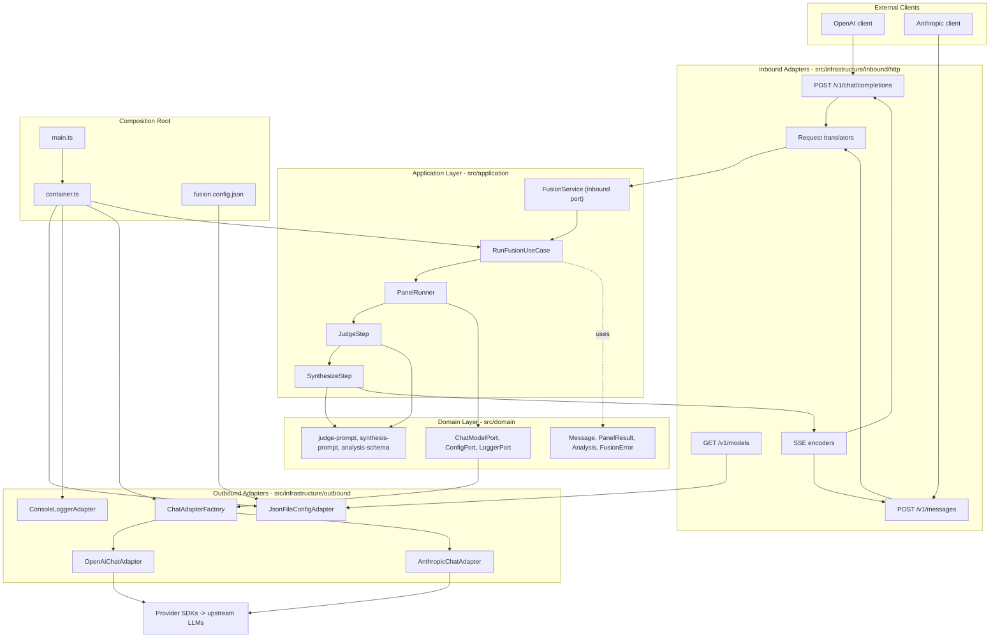

# fusion-local-proxy

A locally deployed proxy that compounds model intelligence. It exposes both
**OpenAI-compatible** (`POST /v1/chat/completions`) and **Anthropic-compatible**
(`POST /v1/messages`) HTTP APIs, and internally runs an **ensemble pipeline**:
it fans out your prompt to a configurable panel of models, optionally runs a
judge model that produces a structured comparative analysis, then streams a
single synthesized response back to the client.

The server is built with a **hexagonal (ports-and-adapters) architecture**, so
the same ensemble pipeline serves both inbound APIs and can talk to local
(Ollama / LM Studio), OpenRouter, or direct OpenAI / Anthropic backends through
configuration alone — no code changes required.

## Architecture



Data flows: **client → inbound route → translator → `FusionService.runFusion()`
→ ensemble use case → outbound `ChatModelPort` → provider SDKs → upstream LLMs**,
with the synthesized stream returning back through the SSE encoders to the client.

## Prerequisites

- [Node.js 20+](https://nodejs.org/)
- A package manager (npm, bundled with Node.js)

No global installs are required — `tsx` (the TypeScript runner used for `dev`,
`start`, and tests) is included as a dev dependency.

## Installation and setup

```bash
git clone <your-repo-url>
cd fusion-local-proxy
npm install

# Configure API keys
cp .env.example .env
# then edit .env and fill in the keys you need
# (OPENAI_API_KEY, ANTHROPIC_API_KEY, OLLAMA_API_KEY, OPENROUTER_API_KEY)

# Review and adjust provider entries for your backends
$EDITOR fusion.config.json
```

## Configuration reference

The server reads `fusion.config.json` (or the path in `FUSION_CONFIG_PATH`) at
startup. Each entry in `providers` is a model backend assigned a role in the
ensemble.

| Field                          | Type                                   | Required | Description                                                                                                                                                                                                                                                                 |
| ------------------------------ | -------------------------------------- | -------- | --------------------------------------------------------------------------------------------------------------------------------------------------------------------------------------------------------------------------------------------------------------------------- |
| `providers`                    | array                                  | yes      | Array of provider objects. Each provider is a model backend with an assigned role.                                                                                                                                                                                          |
| `providers[].type`             | `"openai" \| "anthropic"`              | yes      | Protocol/API type of the provider. Determines which outbound adapter is used.                                                                                                                                                                                               |
| `providers[].role`             | `"panel" \| "judge" \| "synthesizer"`  | yes      | Role in the ensemble pipeline. At least one `"synthesizer"` is required. `judge` is optional (analysis is skipped when absent), and a `panel` role should be present for meaningful ensemble behavior.                                                                      |
| `providers[].model`            | string                                 | yes      | Model name passed to the upstream API (e.g. `"llama3:8b"`, `"gpt-4o"`, `"claude-sonnet-4-20250514"`).                                                                                                                                                                       |
| `providers[].baseURL`          | string                                 | yes      | Base URL of the API endpoint, including the path prefix (e.g. `"http://localhost:11434/v1"` for local Ollama, `"https://api.openai.com/v1"` for OpenAI).                                                                                                                    |
| `providers[].apiKeyEnv`        | string                                 | yes      | Name of the environment variable holding the API key. The adapter reads `process.env[apiKeyEnv]` at startup and fails fast if it is unset.                                                                                                                                  |
| `providers[].jsonMode`         | `"json_object" \| "json_schema"`       | no       | Structured-output mode used when this provider is the judge. Defaults to `"json_schema"` (OpenAI strict mode). Set to `"json_object"` for backends that support only basic JSON mode (e.g. DeepSeek).                                                                       |
| `providers[].thinkingStrength` | `"off" \| "low" \| "medium" \| "high"` | no       | Reasoning/thinking effort level. When set (and not `"off"`), enables extended reasoning: OpenAI models receive `reasoning_effort`; Anthropic models receive `thinking.budget_tokens` (1024 / 4096 / 12 000 tokens respectively). Only set this on reasoning-capable models. |
| `timeoutMs`                    | number                                 | no       | Per-call timeout in milliseconds (default: `30000`). Applies to each outbound LLM call.                                                                                                                                                                                     |

Multiple providers can share the same `role` (e.g. several `panel` members). The
`type` must match the actual API protocol of the backend — note that
OpenAI-compatible servers such as Ollama and OpenRouter use `type: "openai"`.

The bundled `fusion.config.json` is a realistic example that mixes a local
Ollama panel model, a DeepSeek panel model, an OpenRouter panel model, an OpenAI
judge, and an Anthropic synthesizer:

```json
{
  "providers": [
    {
      "type": "openai",
      "role": "panel",
      "model": "llama3:8b",
      "baseURL": "http://localhost:11434/v1",
      "apiKeyEnv": "OLLAMA_API_KEY"
    },
    {
      "type": "openai",
      "role": "panel",
      "model": "deepseek-v4-pro",
      "baseURL": "https://api.deepseek.com",
      "apiKeyEnv": "DEEPSEEK_API_KEY",
      "jsonMode": "json_object"
    },
    {
      "type": "openai",
      "role": "panel",
      "model": "openai/gpt-4.1-mini",
      "baseURL": "https://openrouter.ai/api/v1",
      "apiKeyEnv": "OPENROUTER_API_KEY"
    },
    {
      "type": "openai",
      "role": "judge",
      "model": "gpt-4o",
      "baseURL": "https://api.openai.com/v1",
      "apiKeyEnv": "OPENAI_API_KEY"
    },
    {
      "type": "anthropic",
      "role": "synthesizer",
      "model": "claude-sonnet-4-20250514",
      "baseURL": "https://api.anthropic.com/v1",
      "apiKeyEnv": "ANTHROPIC_API_KEY",
      "thinkingStrength": "medium"
    }
  ],
  "timeoutMs": 30000
}
```

## API usage

Both endpoints accept any `model` value in the request body — the ensemble
pipeline is driven by `fusion.config.json`, not by the requested model name.

### OpenAI — non-streaming

```bash
curl -s http://localhost:3000/v1/chat/completions \
  -H "Content-Type: application/json" \
  -d '{"model":"fusion","messages":[{"role":"user","content":"What are the trade-offs between monoliths and microservices?"}]}'
```

Returns a single JSON object with `object: "chat.completion"`.

### OpenAI — streaming

```bash
curl -N http://localhost:3000/v1/chat/completions \
  -H "Content-Type: application/json" \
  -d '{"model":"fusion","messages":[{"role":"user","content":"Explain the CAP theorem"}],"stream":true}'
```

Streaming responses use Server-Sent Events. Expect keep-alive comment lines
(`: panel running`, `: judging`) while the ensemble works, followed by `data:`
lines carrying `object: "chat.completion.chunk"` payloads, and a final
`data: [DONE]` line.

### Anthropic — streaming

```bash
curl -N http://localhost:3000/v1/messages \
  -H "Content-Type: application/json" \
  -H "x-api-key: anthropic-key" \
  -d '{"model":"fusion","max_tokens":1024,"messages":[{"role":"user","content":"Explain the CAP theorem"}]}'
```

The Anthropic endpoint emits the full 6-event SSE sequence, each carrying both
`event:` and `data:` fields, in this order:

`message_start` → `content_block_start` → `content_block_delta` (one per token
chunk) → `content_block_stop` → `message_delta` → `message_stop`.

### Models

```bash
curl -s http://localhost:3000/v1/models
```

Returns a stub `object: "list"` of the configured models.

## Development workflow

| Command                                       | Description                                              |
| --------------------------------------------- | -------------------------------------------------------- |
| `npm run dev`                                 | Start the dev server (`tsx src/main.ts`).                |
| `npm start`                                   | Same as `npm run dev`.                                   |
| `npm run typecheck`                           | Type-check the project (`tsc --noEmit`).                 |
| `node --import tsx --test "src/**/*.test.ts"` | Run the test suite (`node:test` + `node:assert/strict`). |
| `npm run lint`                                | Lint with ESLint (flat config + typescript-eslint).      |
| `npm run lint:fix`                            | Lint and auto-fix fixable violations.                    |
| `npm run format`                              | Format all files with Prettier.                          |
| `npm run format:check`                        | Check formatting without writing files.                  |

The default port is `3000`; override it with the `PORT` environment variable.

> Note: tests are the colocated `*.test.ts` suites, run with Node's built-in
> test runner and the `tsx` loader:
> `node --import tsx --test "src/**/*.test.ts"`.

## Environment variables

| Variable             | Required                                            | Purpose                                                 |
| -------------------- | --------------------------------------------------- | ------------------------------------------------------- |
| `OPENAI_API_KEY`     | if a provider has `apiKeyEnv: "OPENAI_API_KEY"`     | API key for OpenAI-compatible backends                  |
| `ANTHROPIC_API_KEY`  | if a provider has `apiKeyEnv: "ANTHROPIC_API_KEY"`  | API key for Anthropic backends                          |
| `OLLAMA_API_KEY`     | if a provider has `apiKeyEnv: "OLLAMA_API_KEY"`     | API key for local Ollama (any non-empty string)         |
| `OPENROUTER_API_KEY` | if a provider has `apiKeyEnv: "OPENROUTER_API_KEY"` | API key for OpenRouter                                  |
| `DEEPSEEK_API_KEY`   | if a provider has `apiKeyEnv: "DEEPSEEK_API_KEY"`   | API key for DeepSeek                                    |
| `PORT`               | no                                                  | HTTP server port (default: `3000`)                      |
| `FUSION_CONFIG_PATH` | no                                                  | Path to the config file (default: `fusion.config.json`) |

See [`.env.example`](./.env.example) for a template.

## Project structure

- `src/domain/model/` — pure domain types (`Message`, `PanelResult`, `FusionError`, …)
- `src/domain/ports/` — outbound port interfaces (`ChatModelPort`, `ConfigPort`, `LoggerPort`, `ClockPort`)
- `src/domain/services/` — pure logic (prompt builders, analysis schema)
- `src/application/ports/` — inbound port (`FusionService`)
- `src/application/usecases/` — use-case orchestration (`RunFusionUseCase`, `PanelRunner`, `JudgeStep`, `SynthesizeStep`)
- `src/infrastructure/inbound/http/` — Hono server, OpenAI and Anthropic routes, translators, SSE encoders
- `src/infrastructure/outbound/llm/` — `OpenAiChatAdapter`, `AnthropicChatAdapter`, `ChatAdapterFactory`
- `src/infrastructure/outbound/config/` — `JsonFileConfigAdapter`
- `src/infrastructure/outbound/logging/` — `ConsoleLoggerAdapter`
- `src/infrastructure/di/` — composition root (`container.ts`)
- `src/main.ts` — bootstrap

## License

See [LICENSE](./LICENSE).
