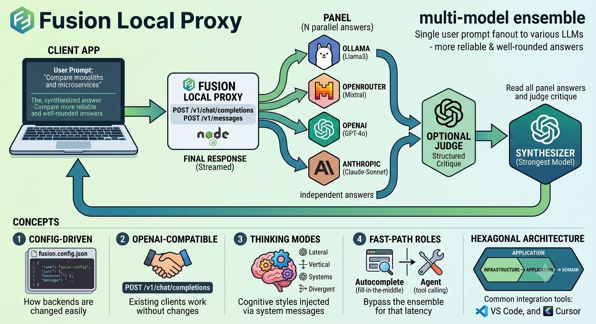
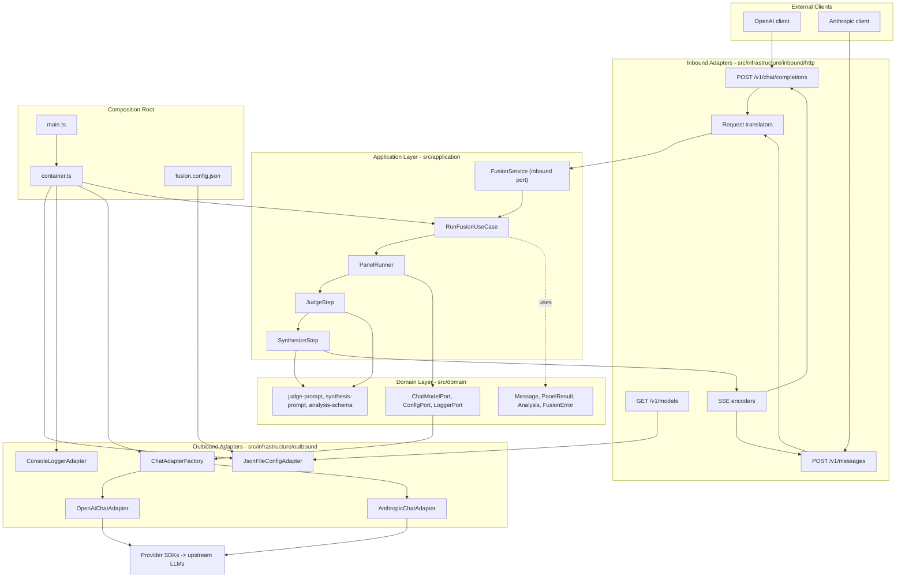

# Fusion Local Proxy

[](https://nodejs.org/)
[](./LICENSE)

<p align="center">
  
</p>

**English** | [简体中文](./README.zh-CN.md)

Get more reliable, well-rounded answers from LLMs by running multiple models in
parallel and merging their outputs into a single response.
`fusion-local-proxy` exposes **OpenAI-compatible** (`POST /v1/chat/completions`)
and **Anthropic-compatible** (`POST /v1/messages`) APIs, so any client that
speaks either protocol works without code changes.

Internally it runs an **ensemble pipeline**: it fans out your prompt to a panel
of models, optionally asks a judge model for a structured critique, then streams
a single synthesized response. Backends are selected via `fusion.config.json` —
no code changes needed to switch providers.

## Table of Contents

- [Quickstart](#quickstart)
- [Concepts](#concepts)
- [What to expect](#what-to-expect)
- [Prerequisites](#prerequisites)
- [Configuration reference](#configuration-reference)
  - [Role descriptions](#role-descriptions)
  - [Thinking strength](#thinking-strength)
  - [Thinking mode](#thinking-mode)
  - [Fast-path roles: autocomplete and agent](#fast-path-roles-autocomplete-and-agent)
  - [Panel diversity recommendation](#panel-diversity-recommendation)
- [API usage](#api-usage)
- [Architecture](#architecture)
- [Development workflow](#development-workflow)
- [Environment variables](#environment-variables)
- [Logging](#logging)
- [Dev UI](#dev-ui)
- [Project structure](#project-structure)
- [Troubleshooting](#troubleshooting)
- [License](#license)

## Quickstart

```bash
git clone <your-repo-url>
cd fusion-local-proxy
npm install

# Set up your API key(s)
cp .env.example .env
# Edit .env — add the key(s) for the providers in fusion.config.json

# Start the server (uses the bundled fusion.config.json by default)
npm run dev
```

Then in another terminal:

```bash
curl -s http://localhost:3000/v1/chat/completions \
  -H "Content-Type: application/json" \
  -d '{"model":"fusion","messages":[{"role":"user","content":"Hello!"}]}'
```

Expected response:

```json
{
  "id": "fusion-...",
  "object": "chat.completion",
  "created": 1749123456,
  "model": "fusion",
  "choices": [
    {
      "index": 0,
      "message": { "role": "assistant", "content": "Hello! How can I help you today?" },
      "finish_reason": "stop"
    }
  ],
  "usage": { "prompt_tokens": 45, "completion_tokens": 87, "total_tokens": 132 }
}
```

> The bundled `fusion.config.json` uses `DEEPSEEK_API_KEY`. Edit the config or
> set `FUSION_CONFIG_PATH` to point at your own config file to use other
> providers.

## Concepts

Three roles form the ensemble pipeline:

| Role            | What it does                                                                                                                                       |
| --------------- | -------------------------------------------------------------------------------------------------------------------------------------------------- |
| **panel**       | One or more models that each independently answer your prompt in parallel.                                                                         |
| **judge**       | An optional model that compares all panel answers and produces a structured critique. When omitted, the synthesizer handles evaluation internally. |
| **synthesizer** | The model that reads the panel answers (and optional judge critique) and streams the single final response you receive.                            |

The pipeline is:

```
Panel (N independent answers) → Judge (optional critique) → Synthesizer (final streamed reply)
```

All three map to entries in `fusion.config.json`. You can mix providers freely:
local ([Ollama](https://ollama.com/) / LM Studio),
[OpenRouter](https://openrouter.ai/), [OpenAI](https://platform.openai.com/),
or [Anthropic](https://anthropic.com/).

## What to expect

Because every request fans out to multiple models before streaming the final
answer, responses take **longer** than a direct single-model call and consume
**more tokens** (panel input + panel output re-encoded as synthesizer input +
synthesizer output). Budget 10–60 seconds per request depending on your model
choices and network latency.

The server starts streaming the synthesized response as soon as the synthesizer
begins producing tokens, so the perceived wait is roughly:
`max(panel latencies)` + `judge latency` + synthesizer time-to-first-token.

## Prerequisites

- [Node.js 20+](https://nodejs.org/)
- npm (bundled with Node.js)

No global installs are required — `tsx` (the TypeScript runner used for `dev`,
`start`, and tests) is a dev dependency.

## Configuration reference

The server reads `fusion.config.json` (or the path in `FUSION_CONFIG_PATH`) at
startup. The minimum viable config is one `panel` and one `synthesizer`:

```json
{
  "providers": [
    {
      "type": "openai",
      "role": "panel",
      "model": "llama3:8b",
      "baseURL": "http://localhost:11434/v1",
      "apiKeyEnv": "OLLAMA_API_KEY"
    },
    {
      "type": "openai",
      "role": "synthesizer",
      "model": "gpt-4o",
      "baseURL": "https://api.openai.com/v1",
      "apiKeyEnv": "OPENAI_API_KEY"
    }
  ]
}
```

Fields for each provider entry:

| Field                          | Type                                                  | Required | Description                                                                                                                                                     |
| ------------------------------ | ----------------------------------------------------- | -------- | --------------------------------------------------------------------------------------------------------------------------------------------------------------- |
| `providers`                    | array                                                 | yes      | Array of provider objects. Each provider is a model backend with an assigned role.                                                                              |
| `providers[].type`             | `"openai" \| "anthropic"`                             | yes      | Protocol adapter to use. `"openai"` covers OpenAI, Ollama, OpenRouter, DeepSeek, and any OpenAI-compatible server.                                              |
| `providers[].role`             | `"panel" \| "judge" \| "synthesizer"`                 | yes      | Role in the ensemble pipeline. See [Role descriptions](#role-descriptions).                                                                                     |
| `providers[].model`            | string                                                | yes      | Model name passed to the upstream API (e.g. `"llama3:8b"`, `"gpt-4o"`, `"claude-sonnet-4-20250514"`).                                                           |
| `providers[].baseURL`          | string                                                | yes      | Base URL of the API endpoint, including the path prefix (e.g. `"http://localhost:11434/v1"` for Ollama, `"https://api.openai.com/v1"` for OpenAI).              |
| `providers[].apiKeyEnv`        | string                                                | yes      | Name of the environment variable holding the API key. Fails fast at startup if the variable is unset.                                                           |
| `providers[].jsonMode`         | `"json_object" \| "json_schema"`                      | no       | Structured-output mode for judge providers. Defaults to `"json_schema"`. Set to `"json_object"` for backends that support only basic JSON mode (e.g. DeepSeek). |
| `providers[].thinkingStrength` | `"off" \| "low" \| "medium" \| "high" \| "xhigh"`     | no       | Reasoning effort level. See [Thinking strength](#thinking-strength).                                                                                            |
| `providers[].thinkingMode`     | `"lateral" \| "vertical" \| "systems" \| "divergent"` | no       | Cognitive style injected as a system message. Panel-only. See [Thinking mode](#thinking-mode).                                                                  |
| `timeoutMs`                    | number                                                | no       | Per-call timeout in milliseconds (default: `30000`). Applies to each outbound LLM call.                                                                         |

Multiple providers can share the same `role` (e.g. several `panel` members). The
`type` must match the actual API protocol of the backend — note that
OpenAI-compatible servers such as Ollama and OpenRouter use `type: "openai"`.

### Role descriptions

**`panel`** — models that independently answer the user's prompt in parallel. At
least one `panel` entry is needed for meaningful ensemble behavior.

**`judge`** (optional) — receives all panel answers and produces a structured
comparative analysis (agreement, disagreement, gaps, recommendation). When the
`judge` is omitted, the `synthesizer` receives an enhanced prompt that performs
this evaluation internally — it classifies the task, verifies convergence, and
finds issues and gaps before writing the final answer. This saves one LLM
round-trip at the cost of a single model doing both jobs.

**`synthesizer`** (required) — reads the panel answers plus the optional judge
analysis and streams the final reply to the client. Use the strongest model
available to you here.

### Thinking strength

`thinkingStrength` enables extended reasoning on models that support it. When
set (and not `"off"`), the adapter activates the model's built-in reasoning
mode. Only use this on reasoning-capable models.

- **OpenAI models** receive `reasoning_effort` passed through as-is
  (`low` / `medium` / `high` / `xhigh`). `xhigh` is OpenAI's deepest reasoning
  tier.
- **Anthropic models** receive `thinking.budget_tokens`: `low` → 1 024,
  `medium` → 4 096, `high` → 12 000, `xhigh` → 24 000 tokens. `xhigh` forces
  `max_tokens` up to ~28 000 to accommodate the thinking budget — only use it
  on models whose maximum output supports it.

### Thinking mode

`thinkingMode` injects a cognitive-style instruction as a leading system message
for that panelist's copy of the prompt. **Panel-only** — the field is rejected
on `judge` and `synthesizer` entries.

| Value       | Instruction style                                           |
| ----------- | ----------------------------------------------------------- |
| `lateral`   | Challenge assumptions and seek unexpected angles.           |
| `vertical`  | Step-by-step logic; converge on the most defensible answer. |
| `systems`   | Trace interdependencies and second-order effects.           |
| `divergent` | Generate a wide range of alternatives before converging.    |

Assigning different modes to different panel models steers each toward a
distinct perspective, amplifying the diversity benefit of the ensemble.

### Fast-path roles: autocomplete and agent

Two optional roles bypass the full ensemble pipeline for latency-sensitive use
cases:

| Role           | Endpoint served                                       | Description                                                                                                              |
| -------------- | ----------------------------------------------------- | ------------------------------------------------------------------------------------------------------------------------ |
| `autocomplete` | `POST /v1/completions`                                | FIM (fill-in-the-middle) text completion for tab autocomplete. Receives `prompt` and optional `suffix`. No deliberation. |
| `agent`        | `POST /v1/chat/completions` (when `tools` is present) | Single-model tool-calling passthrough for agent mode / file edits. The full fusion ensemble is bypassed.                 |

Both roles **must** have `type: "openai"` (they use the OpenAI adapter for
tool-calls and legacy completions). Both support `thinkingStrength` but not
`thinkingMode`.

**Model resolution order** (same for both roles):

1. A provider explicitly assigned `role: "autocomplete"` or `role: "agent"` is
   used as-is.
2. If no dedicated provider exists, the first `panel` provider is used — but
   `thinkingMode` and `thinkingStrength` are stripped so the model receives the
   prompt raw without cognitive-style injection.
3. If no `openai`-type model can be resolved (e.g. all panels are `anthropic`),
   the endpoint returns `501 Not Implemented`.

**Example — adding dedicated agent and autocomplete models:**

```json
{
  "providers": [
    {
      "type": "openai",
      "role": "panel",
      "model": "llama3:8b",
      "baseURL": "http://localhost:11434/v1",
      "apiKeyEnv": "OLLAMA_API_KEY"
    },
    {
      "type": "openai",
      "role": "synthesizer",
      "model": "gpt-4o",
      "baseURL": "https://api.openai.com/v1",
      "apiKeyEnv": "OPENAI_API_KEY"
    },
    {
      "type": "openai",
      "role": "agent",
      "model": "gpt-4o",
      "baseURL": "https://api.openai.com/v1",
      "apiKeyEnv": "OPENAI_API_KEY"
    },
    {
      "type": "openai",
      "role": "autocomplete",
      "model": "deepseek-coder-v2:16b",
      "baseURL": "http://localhost:11434/v1",
      "apiKeyEnv": "OLLAMA_API_KEY"
    }
  ]
}
```

If you omit the `agent` and `autocomplete` entries but have at least one
`openai`-type panel, the first such panel model is used automatically.

### Panel diversity recommendation

The ensemble pipeline produces the most value when the panel is **genuinely
diverse** — different model families, sizes, or reasoning styles. A panel of
repeated instances of the same model tends to produce trivial agreements (shared
training blind spots converge, not genuine correctness) and marginal
discrepancies (sampling noise, not real disagreement), with a judge that cannot
distinguish between them.

Similarly, using the same model family as both judge and panel undermines the
judge's independent verification premise: a model cannot reliably spot its own
blind spots.

Recommendations:

- Use at least two **distinct** model families in the panel (e.g. one
  open-weight local model via Ollama + one frontier API model).
- Assign the `judge` role to a model that is **not** in the panel and preferably
  from a different provider/family.
- The `synthesizer` may share a family with the judge but should be the
  strongest model available to you for the final answer.

**Aspirational multi-provider example** (illustrates the diversity principle;
your actual config will vary based on which APIs you have access to):

```json
{
  "providers": [
    {
      "type": "openai",
      "role": "panel",
      "model": "llama3:8b",
      "baseURL": "http://localhost:11434/v1",
      "apiKeyEnv": "OLLAMA_API_KEY",
      "thinkingMode": "lateral"
    },
    {
      "type": "openai",
      "role": "panel",
      "model": "deepseek-v4-pro",
      "baseURL": "https://api.deepseek.com",
      "apiKeyEnv": "DEEPSEEK_API_KEY",
      "jsonMode": "json_object",
      "thinkingMode": "vertical"
    },
    {
      "type": "openai",
      "role": "panel",
      "model": "openai/gpt-4.1-mini",
      "baseURL": "https://openrouter.ai/api/v1",
      "apiKeyEnv": "OPENROUTER_API_KEY",
      "thinkingMode": "systems"
    },
    {
      "type": "openai",
      "role": "judge",
      "model": "gpt-4o",
      "baseURL": "https://api.openai.com/v1",
      "apiKeyEnv": "OPENAI_API_KEY"
    },
    {
      "type": "anthropic",
      "role": "synthesizer",
      "model": "claude-sonnet-4-20250514",
      "baseURL": "https://api.anthropic.com/v1",
      "apiKeyEnv": "ANTHROPIC_API_KEY",
      "thinkingStrength": "medium"
    }
  ],
  "timeoutMs": 30000
}
```

> **Shipped default:** The bundled `fusion.config.json` uses three
> `deepseek-v4-pro` instances (two panel models with different `thinkingMode`
> values + one synthesizer with `thinkingStrength: "xhigh"`) — a minimal
> single-key setup that works out of the box with only `DEEPSEEK_API_KEY`. It
> uses `timeoutMs: 300000` (5 minutes) to accommodate high-reasoning-effort
> calls. Edit or replace it once you have additional provider keys to take
> advantage of true panel diversity.

## API usage

Both endpoints accept any `model` value in the request body — the ensemble
pipeline is driven by `fusion.config.json`, not by the requested model name.

### OpenAI — non-streaming

```bash
curl -s http://localhost:3000/v1/chat/completions \
  -H "Content-Type: application/json" \
  -d '{"model":"fusion","messages":[{"role":"user","content":"What are the trade-offs between monoliths and microservices?"}]}'
```

Returns a single JSON object:

```json
{
  "id": "fusion-...",
  "object": "chat.completion",
  "created": 1749123456,
  "model": "fusion",
  "choices": [
    {
      "index": 0,
      "message": {
        "role": "assistant",
        "content": "Monoliths are simpler to deploy and reason about at small scale..."
      },
      "finish_reason": "stop"
    }
  ],
  "usage": { "prompt_tokens": 245, "completion_tokens": 312, "total_tokens": 557 }
}
```

### OpenAI — streaming

```bash
curl -N http://localhost:3000/v1/chat/completions \
  -H "Content-Type: application/json" \
  -d '{"model":"fusion","messages":[{"role":"user","content":"Explain the CAP theorem"}],"stream":true}'
```

Streaming responses use Server-Sent Events. Expect keep-alive comment lines
(`: panel running`, `: judging`) while the ensemble works, followed by `data:`
lines carrying `object: "chat.completion.chunk"` payloads, and a final
`data: [DONE]` line.

### Anthropic — streaming

```bash
curl -N http://localhost:3000/v1/messages \
  -H "Content-Type: application/json" \
  -H "x-api-key: anthropic-key" \
  -d '{"model":"fusion","max_tokens":1024,"messages":[{"role":"user","content":"Explain the CAP theorem"}]}'
```

The Anthropic endpoint emits the full 6-event SSE sequence, each carrying both
`event:` and `data:` fields, in this order:

`message_start` → `content_block_start` → `content_block_delta` (one per token
chunk) → `content_block_stop` → `message_delta` → `message_stop`.

### Tab autocomplete — `POST /v1/completions`

FIM (fill-in-the-middle) text completion. Used by VS Code / Cursor autocomplete
extensions:

```bash
curl -s http://localhost:3000/v1/completions \
  -H "Content-Type: application/json" \
  -d '{"model":"fusion","prompt":"def hello","suffix":"\n    pass","max_tokens":64}'
```

Returns `object: "text_completion"` with `choices[0].text`. Pass `"stream": true`
for SSE.

Requires an `openai`-type model resolved via the `autocomplete` or `panel` role.
Returns `501` when no such model is configured.

### Agent / tool calling — `POST /v1/chat/completions` with `tools`

When the request body includes a `tools` array, the full ensemble is bypassed
and the request goes directly to the resolved agent model:

```bash
curl -s http://localhost:3000/v1/chat/completions \
  -H "Content-Type: application/json" \
  -d '{
    "model": "fusion",
    "messages": [{"role": "user", "content": "What is the weather in NYC?"}],
    "tools": [{"type": "function", "function": {"name": "get_weather", "description": "Get weather", "parameters": {"type": "object", "properties": {"city": {"type": "string"}}}}}],
    "tool_choice": "auto",
    "stream": true
  }'
```

Tool call deltas are streamed as `choices[0].delta.tool_calls` chunks. The
non-streaming path reconstructs and returns complete `message.tool_calls`. The
`finish_reason` reflects `"tool_calls"` or `"stop"` as reported by the model.

### Models

```bash
curl -s http://localhost:3000/v1/models
```

Returns a stub `object: "list"` of the configured models.

## Architecture

The server is built with a **hexagonal (ports-and-adapters) architecture** so
the ensemble pipeline is independent of the HTTP protocol, provider SDK, or
config format. Dependencies point inward only:
`infrastructure → application → domain`.



Data flows: **client → inbound route → translator → `FusionService.runFusion()`
→ ensemble use case → outbound `ChatModelPort` → provider SDKs → upstream LLMs**,
with the synthesized stream returning back through the SSE encoders to the client.

## Development workflow

| Command                                       | Description                                              |
| --------------------------------------------- | -------------------------------------------------------- |
| `npm run dev`                                 | Start the dev server (`tsx src/main.ts`).                |
| `npm start`                                   | Same as `npm run dev`.                                   |
| `npm run typecheck`                           | Type-check the project (`tsc --noEmit`).                 |
| `node --import tsx --test "src/**/*.test.ts"` | Run the test suite (`node:test` + `node:assert/strict`). |
| `npm run lint`                                | Lint with ESLint (flat config + typescript-eslint).      |
| `npm run lint:fix`                            | Lint and auto-fix fixable violations.                    |
| `npm run format`                              | Format all files with Prettier.                          |
| `npm run format:check`                        | Check formatting without writing files.                  |

The default port is `3000`; override it with the `PORT` environment variable.

> Tests are the colocated `*.test.ts` suites run with Node's built-in test
> runner and the `tsx` loader:
> `node --import tsx --test "src/**/*.test.ts"`.

## Environment variables

| Variable             | Required                                            | Purpose                                                                 |
| -------------------- | --------------------------------------------------- | ----------------------------------------------------------------------- |
| `OPENAI_API_KEY`     | if a provider has `apiKeyEnv: "OPENAI_API_KEY"`     | API key for OpenAI-compatible backends                                  |
| `ANTHROPIC_API_KEY`  | if a provider has `apiKeyEnv: "ANTHROPIC_API_KEY"`  | API key for Anthropic backends                                          |
| `OLLAMA_API_KEY`     | if a provider has `apiKeyEnv: "OLLAMA_API_KEY"`     | API key for local Ollama (any non-empty string)                         |
| `OPENROUTER_API_KEY` | if a provider has `apiKeyEnv: "OPENROUTER_API_KEY"` | API key for OpenRouter                                                  |
| `DEEPSEEK_API_KEY`   | if a provider has `apiKeyEnv: "DEEPSEEK_API_KEY"`   | API key for DeepSeek                                                    |
| `PORT`               | no                                                  | HTTP server port (default: `3000`)                                      |
| `FUSION_CONFIG_PATH` | no                                                  | Path to the config file (default: `fusion.config.json`)                 |
| `ENABLE_DEV_UI`      | no                                                  | Set to `1` or `true` to enable the browser-based dev chat UI at `GET /` |
| `LOG_LEVEL`          | no                                                  | Log verbosity: `debug` \| `info` \| `warn` \| `error` (default: `info`) |
| `NO_COLOR`           | no                                                  | Set to any non-empty value to disable colored log output                |
| `FORCE_COLOR`        | no                                                  | Set to any non-empty value to force colored log output (e.g. non-TTY)   |

See [`.env.example`](./.env.example) for a template.

## Logging

The server emits structured single-line JSON logs through `ConsoleLoggerAdapter`.
Each line carries a timestamp (`ts`), a `level`, and an `event`. `error`/`warn`
lines go to stderr; everything else goes to stdout. Verbosity is controlled by
`LOG_LEVEL` (default `info`). Logs are colored by level when stdout is a TTY
(debug=white, info=bright cyan, warn=bright yellow, error=bright red); color is
automatically disabled when output is piped or redirected.

**At `info` (default) you will see:**

- `server_starting` / `server_listening` — startup events carrying the bound
  port.
- `http_request` — one line per inbound request, including `requestedModel`
  (a reminder that the ensemble ignores the requested model name and reads
  backends from `fusion.config.json`).
- `fusion_run_start` / `fusion_run_end` — lifecycle bookends with a `requestId`
  that correlates every log line for a single client request.
- Per-stage `start`/`end` markers with token usage.
- `failed_model` warnings when a panel or judge call fails.
- Errors, including the judge's raw model output when a response fails JSON
  parsing or schema validation.

<details>
<summary>Advanced: token cost breakdown and debug logging</summary>

**Token cost breakdown (`fusion_run_end`):**

`fusion_run_end` carries a `tokensByStage` field reporting `{ total, reasoning }`
per stage, and a `cost` block with `inputTokens`, `outputTokens`,
`reasoningTokens` (the billed-but-invisible subset of output), and
`reEncodedPanelTokens` (panel output re-billed as synthesizer input). `reasoning`
token counts come from providers that report them (e.g. OpenAI
`completion_tokens_details.reasoning_tokens`); Anthropic folds extended thinking
into `output_tokens` and does not report it separately.

**`LOG_LEVEL=debug`:**

Set `LOG_LEVEL=debug` to additionally see, for **every** panel/judge/synthesizer
call:

- A `request` line: target model, provider, baseURL, message count, prompt size,
  response format, thinking strength, thinking mode, a per-call `label` (e.g.
  `panel-0`), and the full `prompt` messages sent to the model.
- A `response` line: latency, time-to-first-token, streamed delta count, content
  size, token usage (including a `reasoning` sub-field when reported),
  `reasoningChars` for the size of hidden reasoning seen on the stream, and the
  full `content` returned by the model.

All lines for one client request share the same `requestId`:

```bash
LOG_LEVEL=debug npm run dev
```

</details>

## Dev UI

A lightweight browser-based chat tester is built into the server. It is
disabled by default and must be enabled explicitly:

```bash
ENABLE_DEV_UI=1 npm run dev
```

Then open `http://localhost:3000/` in your browser.

The UI:

- Populates a model dropdown from `GET /v1/models` (reflects your
  `fusion.config.json`).
- Sends messages as `POST /v1/chat/completions` with `stream: true` and renders
  the streamed response token-by-token.
- Surfaces the ensemble progress comments (`: panel running`, `: judging`) as a
  status line while the pipeline runs.
- Maintains the full conversation history for multi-turn sessions (use **Clear**
  to reset).

The page is served from `public/index.html` as a static file by the existing
Hono server. It is same-origin, so no CORS configuration is needed and your API
keys never leave the server process.

## Project structure

- `src/domain/model/` — pure domain types (`Message`, `PanelResult`,
  `FusionError`, …)
- `src/domain/ports/` — outbound port interfaces (`ChatModelPort`, `ConfigPort`,
  `LoggerPort`, `ClockPort`)
- `src/domain/services/` — pure logic (prompt builders, analysis schema)
- `src/application/ports/` — inbound port (`FusionService`)
- `src/application/usecases/` — use-case orchestration (`RunFusionUseCase`,
  `PanelRunner`, `JudgeStep`, `SynthesizeStep`)
- `src/infrastructure/inbound/http/` — Hono server, OpenAI and Anthropic routes,
  translators, SSE encoders
- `src/infrastructure/outbound/llm/` — `OpenAiChatAdapter`,
  `AnthropicChatAdapter`, `ChatAdapterFactory`
- `src/infrastructure/outbound/config/` — `JsonFileConfigAdapter`
- `src/infrastructure/outbound/logging/` — `ConsoleLoggerAdapter`
- `src/infrastructure/di/` — composition root (`container.ts`)
- `src/main.ts` — bootstrap

## Troubleshooting

**Server fails to start with a "missing API key" error**

Each provider's `apiKeyEnv` value must be set in the environment at startup. The
adapter reads `process.env[apiKeyEnv]` and throws immediately if it is unset.
Check that your `.env` file is present and contains values for every key
referenced in `fusion.config.json`. Run `npm run dev` from the project root so
the `.env` file is picked up automatically.

**`/v1/completions` or tool-calling requests return `501 Not Implemented`**

The `autocomplete` and `agent` fast-path endpoints require a provider with
`type: "openai"`. If all your panel providers have `type: "anthropic"` and you
have not defined a dedicated `role: "autocomplete"` or `role: "agent"` entry,
the server cannot resolve a compatible model and returns `501`. Add an
`openai`-type panel or a dedicated `autocomplete`/`agent` entry to your config.

**Ollama or OpenRouter provider errors**

Both Ollama and OpenRouter expose an OpenAI-compatible API. Use `type: "openai"`
for them — **not** `type: "anthropic"`. Setting the wrong type routes the
request through the wrong SDK and will produce errors or unexpected behavior.

**Responses are much slower than a direct API call**

This is expected — see [What to expect](#what-to-expect). If latency is too
high, try: fewer panel models, faster/smaller panel models, removing the `judge`
entry (saves one full LLM round-trip), or reducing `thinkingStrength` on panel
models.

## License

See [LICENSE](./LICENSE).
