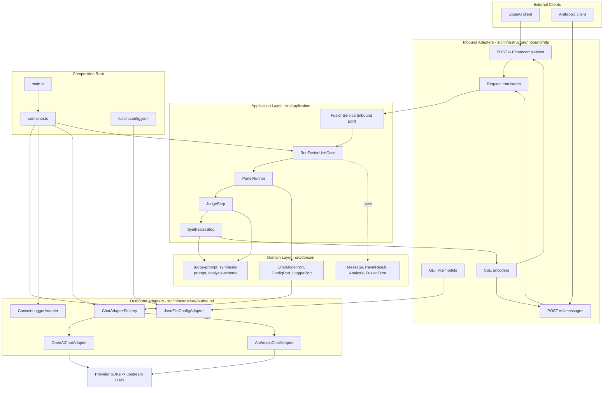

# fusion-local-proxy

A locally deployed proxy that compounds model intelligence. It exposes both
**OpenAI-compatible** (`POST /v1/chat/completions`) and **Anthropic-compatible**
(`POST /v1/messages`) HTTP APIs, and internally runs an **ensemble pipeline**:
it fans out your prompt to a configurable panel of models, optionally runs a
judge model that produces a structured comparative analysis, then streams a
single synthesized response back to the client.

The server is built with a **hexagonal (ports-and-adapters) architecture**, so
the same ensemble pipeline serves both inbound APIs and can talk to local
(Ollama / LM Studio), OpenRouter, or direct OpenAI / Anthropic backends through
configuration alone — no code changes required.

## Architecture



Data flows: **client → inbound route → translator → `FusionService.runFusion()`
→ ensemble use case → outbound `ChatModelPort` → provider SDKs → upstream LLMs**,
with the synthesized stream returning back through the SSE encoders to the client.

## Prerequisites

- [Node.js 20+](https://nodejs.org/)
- A package manager (npm, bundled with Node.js)

No global installs are required — `tsx` (the TypeScript runner used for `dev`,
`start`, and tests) is included as a dev dependency.

## Installation and setup

```bash
git clone <your-repo-url>
cd fusion-local-proxy
npm install

# Configure API keys
cp .env.example .env
# then edit .env and fill in the keys you need
# (OPENAI_API_KEY, ANTHROPIC_API_KEY, OLLAMA_API_KEY, OPENROUTER_API_KEY)

# Review and adjust provider entries for your backends
$EDITOR fusion.config.json
```

## Configuration reference

The server reads `fusion.config.json` (or the path in `FUSION_CONFIG_PATH`) at
startup. Each entry in `providers` is a model backend assigned a role in the
ensemble.

| Field                          | Type                                                  | Required | Description                                                                                                                                                                                                                                                                                                                                                                                                                                                                                                                                             |
| ------------------------------ | ----------------------------------------------------- | -------- | ------------------------------------------------------------------------------------------------------------------------------------------------------------------------------------------------------------------------------------------------------------------------------------------------------------------------------------------------------------------------------------------------------------------------------------------------------------------------------------------------------------------------------------------------------- |
| `providers`                    | array                                                 | yes      | Array of provider objects. Each provider is a model backend with an assigned role.                                                                                                                                                                                                                                                                                                                                                                                                                                                                      |
| `providers[].type`             | `"openai" \| "anthropic"`                             | yes      | Protocol/API type of the provider. Determines which outbound adapter is used.                                                                                                                                                                                                                                                                                                                                                                                                                                                                           |
| `providers[].role`             | `"panel" \| "judge" \| "synthesizer"`                 | yes      | Role in the ensemble pipeline. At least one `"synthesizer"` is required. `judge` is optional — when omitted, the synthesizer receives an enhanced self-judging prompt that performs the evaluation internally (classifies the task, verifies convergence, finds issues and gaps) before writing the final answer, saving one round-trip at the cost of a single model doing both jobs. A `panel` role should be present for meaningful ensemble behavior.                                                                                               |
| `providers[].model`            | string                                                | yes      | Model name passed to the upstream API (e.g. `"llama3:8b"`, `"gpt-4o"`, `"claude-sonnet-4-20250514"`).                                                                                                                                                                                                                                                                                                                                                                                                                                                   |
| `providers[].baseURL`          | string                                                | yes      | Base URL of the API endpoint, including the path prefix (e.g. `"http://localhost:11434/v1"` for local Ollama, `"https://api.openai.com/v1"` for OpenAI).                                                                                                                                                                                                                                                                                                                                                                                                |
| `providers[].apiKeyEnv`        | string                                                | yes      | Name of the environment variable holding the API key. The adapter reads `process.env[apiKeyEnv]` at startup and fails fast if it is unset.                                                                                                                                                                                                                                                                                                                                                                                                              |
| `providers[].jsonMode`         | `"json_object" \| "json_schema"`                      | no       | Structured-output mode used when this provider is the judge. Defaults to `"json_schema"` (OpenAI strict mode). Set to `"json_object"` for backends that support only basic JSON mode (e.g. DeepSeek).                                                                                                                                                                                                                                                                                                                                                   |
| `providers[].thinkingStrength` | `"off" \| "low" \| "medium" \| "high" \| "xhigh"`     | no       | Reasoning/thinking effort level. When set (and not `"off"`), enables extended reasoning: OpenAI models receive `reasoning_effort` (passed through as-is); Anthropic models receive `thinking.budget_tokens` (low / medium / high / xhigh → 1024 / 4096 / 12 000 / 24 000 tokens). `xhigh` is OpenAI's deepest tier; on Anthropic it maps to a large token budget (which forces `max_tokens` up to ~28 000, so it is only safe on models whose max output supports it). Only set this on reasoning-capable models.                                       |
| `providers[].thinkingMode`     | `"lateral" \| "vertical" \| "systems" \| "divergent"` | no       | Cognitive style injected as a leading system message for that panelist's copy of the prompt. **Panel-only** (rejected on judge/synthesizer). `lateral` — challenge assumptions and seek unexpected angles; `vertical` — step-by-step logic, converge on the most defensible answer; `systems` — trace interdependencies and second-order effects; `divergent` — generate a wide range of alternatives before converging. Pairs well with panel diversity: assign different modes to different panel models to steer each toward a distinct perspective. |
| `timeoutMs`                    | number                                                | no       | Per-call timeout in milliseconds (default: `30000`). Applies to each outbound LLM call.                                                                                                                                                                                                                                                                                                                                                                                                                                                                 |

Multiple providers can share the same `role` (e.g. several `panel` members). The
`type` must match the actual API protocol of the backend — note that
OpenAI-compatible servers such as Ollama and OpenRouter use `type: "openai"`.

### Fast-path roles: `autocomplete` and `agent`

Two optional roles bypass the full ensemble pipeline for latency-sensitive use cases:

| Role           | Endpoint served                                       | Description                                                                                                              |
| -------------- | ----------------------------------------------------- | ------------------------------------------------------------------------------------------------------------------------ |
| `autocomplete` | `POST /v1/completions`                                | FIM (fill-in-the-middle) text completion for tab autocomplete. Receives `prompt` and optional `suffix`. No deliberation. |
| `agent`        | `POST /v1/chat/completions` (when `tools` is present) | Single-model tool-calling passthrough for agent mode / file edits. The full fusion ensemble is bypassed.                 |

Both roles **must** have `type: "openai"` (they use the OpenAI adapter for tool-calls and legacy completions). Both support `thinkingStrength` but not `thinkingMode`.

**Model resolution order** (same for both roles):

1. A provider explicitly assigned `role: "autocomplete"` or `role: "agent"` is used as-is.
2. If no dedicated provider exists, the first `panel` provider is used — **but `thinkingMode` and `thinkingStrength` are stripped** so the model receives the prompt raw without cognitive-style injection.
3. If no `openai`-type model can be resolved (e.g. all panels are `anthropic`), the endpoint returns `501 Not Implemented`.

**Minimal example adding a dedicated agent model:**

```json
{
  "providers": [
    {
      "type": "openai",
      "role": "panel",
      "model": "llama3:8b",
      "baseURL": "http://localhost:11434/v1",
      "apiKeyEnv": "OLLAMA_API_KEY"
    },
    {
      "type": "openai",
      "role": "synthesizer",
      "model": "gpt-4o",
      "baseURL": "https://api.openai.com/v1",
      "apiKeyEnv": "OPENAI_API_KEY"
    },
    {
      "type": "openai",
      "role": "agent",
      "model": "gpt-4o",
      "baseURL": "https://api.openai.com/v1",
      "apiKeyEnv": "OPENAI_API_KEY"
    },
    {
      "type": "openai",
      "role": "autocomplete",
      "model": "deepseek-coder-v2:16b",
      "baseURL": "http://localhost:11434/v1",
      "apiKeyEnv": "OLLAMA_API_KEY"
    }
  ]
}
```

If you omit the `agent` and `autocomplete` entries but have at least one `openai`-type panel, the first such panel model is used automatically.

### Panel diversity recommendation

The ensemble pipeline produces the most value when the panel is **genuinely diverse** — different model families, sizes, or reasoning styles. A panel composed of repeated instances of the same model, or of models from the same fine-tuning lineage, tends to produce trivial agreements (shared training blind spots converge, not genuine correctness), marginal discrepancies (sampling noise, not real disagreement), and a judge that cannot distinguish between them.

Similarly, using the same model family as both judge and panel undermines the judge's independent verification premise: a model cannot reliably spot its own blind spots.

Recommendations:

- Use at least two **distinct** model families in the panel (e.g. one open-weight local model via Ollama + one frontier API model).
- Assign the `judge` role to a model that is **not** in the panel and preferably from a different provider/family.
- The `synthesizer` may share a family with the judge but should be the strongest model available to you for the final answer.

The bundled `fusion.config.json` is a realistic example that mixes a local
Ollama panel model, a DeepSeek panel model, an OpenRouter panel model, an OpenAI
judge, and an Anthropic synthesizer:

```json
{
  "providers": [
    {
      "type": "openai",
      "role": "panel",
      "model": "llama3:8b",
      "baseURL": "http://localhost:11434/v1",
      "apiKeyEnv": "OLLAMA_API_KEY",
      "thinkingMode": "lateral"
    },
    {
      "type": "openai",
      "role": "panel",
      "model": "deepseek-v4-pro",
      "baseURL": "https://api.deepseek.com",
      "apiKeyEnv": "DEEPSEEK_API_KEY",
      "jsonMode": "json_object",
      "thinkingMode": "vertical"
    },
    {
      "type": "openai",
      "role": "panel",
      "model": "openai/gpt-4.1-mini",
      "baseURL": "https://openrouter.ai/api/v1",
      "apiKeyEnv": "OPENROUTER_API_KEY",
      "thinkingMode": "systems"
    },
    {
      "type": "openai",
      "role": "judge",
      "model": "gpt-4o",
      "baseURL": "https://api.openai.com/v1",
      "apiKeyEnv": "OPENAI_API_KEY"
    },
    {
      "type": "anthropic",
      "role": "synthesizer",
      "model": "claude-sonnet-4-20250514",
      "baseURL": "https://api.anthropic.com/v1",
      "apiKeyEnv": "ANTHROPIC_API_KEY",
      "thinkingStrength": "medium"
    }
  ],
  "timeoutMs": 30000
}
```

## API usage

Both endpoints accept any `model` value in the request body — the ensemble
pipeline is driven by `fusion.config.json`, not by the requested model name.

### OpenAI — non-streaming

```bash
curl -s http://localhost:3000/v1/chat/completions \
  -H "Content-Type: application/json" \
  -d '{"model":"fusion","messages":[{"role":"user","content":"What are the trade-offs between monoliths and microservices?"}]}'
```

Returns a single JSON object with `object: "chat.completion"`.

### OpenAI — streaming

```bash
curl -N http://localhost:3000/v1/chat/completions \
  -H "Content-Type: application/json" \
  -d '{"model":"fusion","messages":[{"role":"user","content":"Explain the CAP theorem"}],"stream":true}'
```

Streaming responses use Server-Sent Events. Expect keep-alive comment lines
(`: panel running`, `: judging`) while the ensemble works, followed by `data:`
lines carrying `object: "chat.completion.chunk"` payloads, and a final
`data: [DONE]` line.

### Anthropic — streaming

```bash
curl -N http://localhost:3000/v1/messages \
  -H "Content-Type: application/json" \
  -H "x-api-key: anthropic-key" \
  -d '{"model":"fusion","max_tokens":1024,"messages":[{"role":"user","content":"Explain the CAP theorem"}]}'
```

The Anthropic endpoint emits the full 6-event SSE sequence, each carrying both
`event:` and `data:` fields, in this order:

`message_start` → `content_block_start` → `content_block_delta` (one per token
chunk) → `content_block_stop` → `message_delta` → `message_stop`.

### Tab autocomplete — `POST /v1/completions`

FIM (fill-in-the-middle) text completion. Used by VS Code / Cursor autocomplete extensions:

```bash
curl -s http://localhost:3000/v1/completions \
  -H "Content-Type: application/json" \
  -d '{"model":"fusion","prompt":"def hello","suffix":"\n    pass","max_tokens":64}'
```

Returns `object: "text_completion"` with `choices[0].text`. Pass `"stream": true` for SSE.

Requires an `openai`-type model resolved via the `autocomplete` or `panel` role. Returns `501` when no such model is configured.

### Agent / tool calling — `POST /v1/chat/completions` with `tools`

When the request body includes a `tools` array, the full ensemble is bypassed and the request goes directly to the resolved agent model:

```bash
curl -s http://localhost:3000/v1/chat/completions \
  -H "Content-Type: application/json" \
  -d '{
    "model": "fusion",
    "messages": [{"role": "user", "content": "What is the weather in NYC?"}],
    "tools": [{"type": "function", "function": {"name": "get_weather", "description": "Get weather", "parameters": {"type": "object", "properties": {"city": {"type": "string"}}}}}],
    "tool_choice": "auto",
    "stream": true
  }'
```

Tool call deltas are streamed as `choices[0].delta.tool_calls` chunks. The non-streaming path reconstructs and returns complete `message.tool_calls`. The `finish_reason` reflects `"tool_calls"` or `"stop"` as reported by the model.

### Models

```bash
curl -s http://localhost:3000/v1/models
```

Returns a stub `object: "list"` of the configured models.

## Development workflow

| Command                                       | Description                                              |
| --------------------------------------------- | -------------------------------------------------------- |
| `npm run dev`                                 | Start the dev server (`tsx src/main.ts`).                |
| `npm start`                                   | Same as `npm run dev`.                                   |
| `npm run typecheck`                           | Type-check the project (`tsc --noEmit`).                 |
| `node --import tsx --test "src/**/*.test.ts"` | Run the test suite (`node:test` + `node:assert/strict`). |
| `npm run lint`                                | Lint with ESLint (flat config + typescript-eslint).      |
| `npm run lint:fix`                            | Lint and auto-fix fixable violations.                    |
| `npm run format`                              | Format all files with Prettier.                          |
| `npm run format:check`                        | Check formatting without writing files.                  |

The default port is `3000`; override it with the `PORT` environment variable.

> Note: tests are the colocated `*.test.ts` suites, run with Node's built-in
> test runner and the `tsx` loader:
> `node --import tsx --test "src/**/*.test.ts"`.

## Environment variables

| Variable             | Required                                            | Purpose                                                                 |
| -------------------- | --------------------------------------------------- | ----------------------------------------------------------------------- |
| `OPENAI_API_KEY`     | if a provider has `apiKeyEnv: "OPENAI_API_KEY"`     | API key for OpenAI-compatible backends                                  |
| `ANTHROPIC_API_KEY`  | if a provider has `apiKeyEnv: "ANTHROPIC_API_KEY"`  | API key for Anthropic backends                                          |
| `OLLAMA_API_KEY`     | if a provider has `apiKeyEnv: "OLLAMA_API_KEY"`     | API key for local Ollama (any non-empty string)                         |
| `OPENROUTER_API_KEY` | if a provider has `apiKeyEnv: "OPENROUTER_API_KEY"` | API key for OpenRouter                                                  |
| `DEEPSEEK_API_KEY`   | if a provider has `apiKeyEnv: "DEEPSEEK_API_KEY"`   | API key for DeepSeek                                                    |
| `PORT`               | no                                                  | HTTP server port (default: `3000`)                                      |
| `FUSION_CONFIG_PATH` | no                                                  | Path to the config file (default: `fusion.config.json`)                 |
| `ENABLE_DEV_UI`      | no                                                  | Set to `1` or `true` to enable the browser-based dev chat UI at `GET /` |
| `LOG_LEVEL`          | no                                                  | Log verbosity: `debug` \| `info` \| `warn` \| `error` (default: `info`) |
| `NO_COLOR`           | no                                                  | Set to any non-empty value to disable colored log output                |
| `FORCE_COLOR`        | no                                                  | Set to any non-empty value to force colored log output (e.g. non-TTY)   |

See [`.env.example`](./.env.example) for a template.

## Logging

The server emits structured single-line JSON logs through `ConsoleLoggerAdapter`.
Each line carries a timestamp (`ts`), a `level`, and an `event`; `error`/`warn`
lines go to stderr, everything else to stdout. Verbosity is controlled by
`LOG_LEVEL` (default `info`).

When stdout is an interactive terminal, each line is colored by level
(debug=white, info=bright cyan, warn=bright yellow, error=bright red) for quick
scanning. Color is disabled automatically when output is piped/redirected so the
JSON stays parseable; override with `NO_COLOR` (force off) or `FORCE_COLOR`
(force on).

Server bootstrap is logged through the same structured logger: `server_starting`
and `server_listening` (each carrying the `port`) replace the previous plain-text
startup lines, so the output stays parseable end to end.

At `info` you get the high-level lifecycle: `fusion_run_start` /
`fusion_run_end` (with a `requestId` correlating every stage of a single run),
per-stage `start`/`end` markers with token usage, inbound `http_request` lines,
`failed_model` warnings, and errors (including the judge's raw model output when
a response fails JSON parsing or schema validation).

The inbound `http_request` line reports the client-requested model under
`requestedModel` (renamed from `model`) as a reminder that the ensemble selects
backends from `fusion.config.json` and ignores the requested model name.

`fusion_run_end` also carries a cost-honest token breakdown. `tokensByStage`
reports `{ total, reasoning }` per stage, and a `cost` block surfaces
`inputTokens`, `outputTokens`, `reasoningTokens` (the billed-but-invisible subset
of output), and `reEncodedPanelTokens` (panel output re-billed as synthesizer
input). `reasoning` token counts come from providers that report them (e.g.
OpenAI `completion_tokens_details.reasoning_tokens`); Anthropic folds extended
thinking into `output_tokens` and does not report it separately.

Set `LOG_LEVEL=debug` to additionally see, for **every** panel/judge/synthesizer
call, a `request` line (target model, provider, baseURL, message count, prompt
size, response format, thinking strength, thinking mode, a per-call `label` such
as `panel-0`, and the full `prompt` messages sent to the model) and a `response`
line (latency, time-to-first-token, streamed delta count, content size, token
usage including a `reasoning` sub-field when reported, `reasoningChars` for the
size of hidden reasoning seen on the stream, and the full `content` returned by
the model) — i.e. exactly how each model parses, sends, and processes a request.
All lines for one client request share the same `requestId`:

```bash
LOG_LEVEL=debug npm run dev
```

## Dev UI

A lightweight browser-based chat tester is built into the server. It is disabled
by default and must be enabled explicitly:

```bash
ENABLE_DEV_UI=1 npm run dev
```

Then open `http://localhost:3000/` in your browser.

The UI:

- Populates a model dropdown from `GET /v1/models` (reflects your `fusion.config.json`).
- Sends messages as `POST /v1/chat/completions` with `stream: true` and renders the streamed response token-by-token.
- Surfaces the ensemble progress comments (`: panel running`, `: judging`) as a status line while the pipeline runs.
- Maintains the full conversation history for multi-turn sessions (use **Clear** to reset).

The page is served from `public/index.html` as a static file by the existing Hono server.
It is same-origin, so no CORS configuration is needed and your API keys never leave the server process.

## Project structure

- `src/domain/model/` — pure domain types (`Message`, `PanelResult`, `FusionError`, …)
- `src/domain/ports/` — outbound port interfaces (`ChatModelPort`, `ConfigPort`, `LoggerPort`, `ClockPort`)
- `src/domain/services/` — pure logic (prompt builders, analysis schema)
- `src/application/ports/` — inbound port (`FusionService`)
- `src/application/usecases/` — use-case orchestration (`RunFusionUseCase`, `PanelRunner`, `JudgeStep`, `SynthesizeStep`)
- `src/infrastructure/inbound/http/` — Hono server, OpenAI and Anthropic routes, translators, SSE encoders
- `src/infrastructure/outbound/llm/` — `OpenAiChatAdapter`, `AnthropicChatAdapter`, `ChatAdapterFactory`
- `src/infrastructure/outbound/config/` — `JsonFileConfigAdapter`
- `src/infrastructure/outbound/logging/` — `ConsoleLoggerAdapter`
- `src/infrastructure/di/` — composition root (`container.ts`)
- `src/main.ts` — bootstrap

## License

See [LICENSE](./LICENSE).
