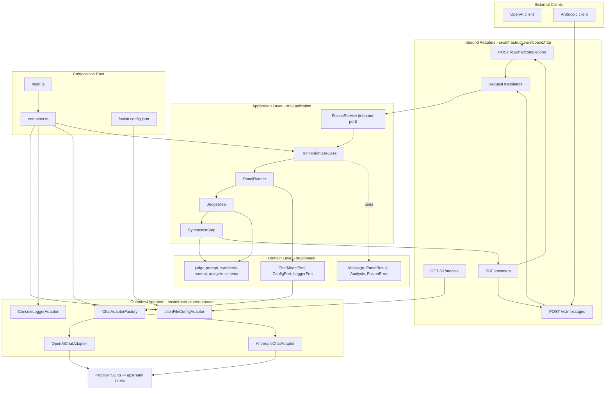

# Fusion Local Proxy

[](https://nodejs.org/)
[](./LICENSE)

<p align="center">
  
</p>

[English](./README.md) | **简体中文**

通过并行运行多个模型并将它们的输出合并为单一响应，从大语言模型（LLM）那里获得更
可靠、更全面的答案。`fusion-local-proxy` 同时提供 **OpenAI 兼容**
（`POST /v1/chat/completions`）和 **Anthropic 兼容**（`POST /v1/messages`）API，
因此任何使用这两种协议之一的客户端都可以零代码改动直接接入。

在内部，它运行一条**集成流水线（ensemble pipeline）**：将你的提示词分发给一组模型
（panel），可选地请求一个裁判模型给出结构化评析，然后流式返回单一的合成响应。后端
通过 `fusion.config.json` 选择——切换供应商无需改动任何代码。

## 目录

- [快速开始](#快速开始)
- [核心概念](#核心概念)
- [预期表现](#预期表现)
- [环境要求](#环境要求)
- [配置参考](#配置参考)
  - [角色说明](#角色说明)
  - [思考强度](#思考强度)
  - [思考模式](#思考模式)
  - [快速通道角色：autocomplete 和 agent](#快速通道角色autocomplete-和-agent)
  - [面板多样性建议](#面板多样性建议)
- [API 使用](#api-使用)
- [架构](#架构)
- [开发工作流](#开发工作流)
- [环境变量](#环境变量)
- [日志](#日志)
- [开发 UI](#开发-ui)
- [项目结构](#项目结构)
- [故障排查](#故障排查)
- [许可证](#许可证)

## 快速开始

```bash
git clone <your-repo-url>
cd fusion-local-proxy
npm install

# 配置你的 API 密钥
cp .env.example .env
# 编辑 .env —— 为 fusion.config.json 中的供应商填入对应密钥

# 启动服务器（默认使用自带的 fusion.config.json）
npm run dev
```

然后在另一个终端中：

```bash
curl -s http://localhost:3000/v1/chat/completions \
  -H "Content-Type: application/json" \
  -d '{"model":"fusion","messages":[{"role":"user","content":"Hello!"}]}'
```

预期响应：

```json
{
  "id": "fusion-...",
  "object": "chat.completion",
  "created": 1749123456,
  "model": "fusion",
  "choices": [
    {
      "index": 0,
      "message": { "role": "assistant", "content": "Hello! How can I help you today?" },
      "finish_reason": "stop"
    }
  ],
  "usage": { "prompt_tokens": 45, "completion_tokens": 87, "total_tokens": 132 }
}
```

> 自带的 `fusion.config.json` 使用 `DEEPSEEK_API_KEY`。编辑该配置文件，或设置
> `FUSION_CONFIG_PATH` 指向你自己的配置文件，即可使用其他供应商。

## 核心概念

集成流水线由三种角色构成：

| 角色                      | 作用                                                                         |
| ------------------------- | ---------------------------------------------------------------------------- |
| **panel（面板）**         | 一个或多个模型，各自独立、并行地回答你的提示词。                             |
| **judge（裁判）**         | 可选模型，比较所有面板答案并产出结构化评析。省略时，由合成器在内部完成评估。 |
| **synthesizer（合成器）** | 读取面板答案（以及可选的裁判评析），流式输出你最终收到的单一响应。           |

流水线如下：

```
Panel（N 个独立答案） → Judge（可选评析） → Synthesizer（最终流式回复）
```

三者都对应 `fusion.config.json` 中的条目。你可以自由混搭不同供应商：本地
（[Ollama](https://ollama.com/) / LM Studio）、
[OpenRouter](https://openrouter.ai/)、[OpenAI](https://platform.openai.com/)
或 [Anthropic](https://anthropic.com/)。

## 预期表现

由于每个请求在流式返回最终答案之前都要分发给多个模型，响应耗时会**比**直接调用单一
模型**更长**，并消耗**更多 token**（面板输入 + 作为合成器输入重新编码的面板输出 +
合成器输出）。请按每个请求 10–60 秒预留时间，具体取决于你选择的模型和网络延迟。

合成器一开始产出 token，服务器就会立即流式返回合成响应，因此感知到的等待时间大致为：
`max(各面板延迟)` + `裁判延迟` + 合成器首 token 时间。

## 环境要求

- [Node.js 20+](https://nodejs.org/)
- npm（随 Node.js 一同安装）

无需任何全局安装——`tsx`（用于 `dev`、`start` 和测试的 TypeScript 运行器）是开发
依赖。

## 配置参考

服务器在启动时读取 `fusion.config.json`（或 `FUSION_CONFIG_PATH` 指定的路径）。最小
可用配置是一个 `panel` 和一个 `synthesizer`：

```json
{
  "providers": [
    {
      "type": "openai",
      "role": "panel",
      "model": "llama3:8b",
      "baseURL": "http://localhost:11434/v1",
      "apiKeyEnv": "OLLAMA_API_KEY"
    },
    {
      "type": "openai",
      "role": "synthesizer",
      "model": "gpt-4o",
      "baseURL": "https://api.openai.com/v1",
      "apiKeyEnv": "OPENAI_API_KEY"
    }
  ]
}
```

每个供应商条目的字段：

| 字段                           | 类型                                                  | 必填 | 说明                                                                                                                    |
| ------------------------------ | ----------------------------------------------------- | ---- | ----------------------------------------------------------------------------------------------------------------------- |
| `providers`                    | 数组                                                  | 是   | 供应商对象数组。每个供应商是一个分配了角色的模型后端。                                                                  |
| `providers[].type`             | `"openai" \| "anthropic"`                             | 是   | 使用的协议适配器。`"openai"` 涵盖 OpenAI、Ollama、OpenRouter、DeepSeek 以及任何 OpenAI 兼容服务器。                     |
| `providers[].role`             | `"panel" \| "judge" \| "synthesizer"`                 | 是   | 在集成流水线中的角色。参见[角色说明](#角色说明)。                                                                       |
| `providers[].model`            | 字符串                                                | 是   | 传给上游 API 的模型名称（如 `"llama3:8b"`、`"gpt-4o"`、`"claude-sonnet-4-20250514"`）。                                 |
| `providers[].baseURL`          | 字符串                                                | 是   | API 端点的基础 URL，含路径前缀（如 Ollama 用 `"http://localhost:11434/v1"`，OpenAI 用 `"https://api.openai.com/v1"`）。 |
| `providers[].apiKeyEnv`        | 字符串                                                | 是   | 存放 API 密钥的环境变量名称。若该变量未设置，启动时会立即失败。                                                         |
| `providers[].jsonMode`         | `"json_object" \| "json_schema"`                      | 否   | 裁判供应商的结构化输出模式。默认 `"json_schema"`。对仅支持基础 JSON 模式的后端（如 DeepSeek）设为 `"json_object"`。     |
| `providers[].thinkingStrength` | `"off" \| "low" \| "medium" \| "high" \| "xhigh"`     | 否   | 推理强度等级。参见[思考强度](#思考强度)。                                                                               |
| `providers[].thinkingMode`     | `"lateral" \| "vertical" \| "systems" \| "divergent"` | 否   | 作为系统消息注入的认知风格。仅限面板使用。参见[思考模式](#思考模式)。                                                   |
| `timeoutMs`                    | 数字                                                  | 否   | 每次调用的超时（毫秒，默认 `30000`）。适用于每次出站 LLM 调用。                                                         |

多个供应商可以共享同一 `role`（例如多个 `panel` 成员）。`type` 必须与后端实际的 API
协议匹配——注意像 Ollama 和 OpenRouter 这样的 OpenAI 兼容服务器使用
`type: "openai"`。

### 角色说明

**`panel`** —— 并行独立回答用户提示词的模型。要获得有意义的集成效果，至少需要一个
`panel` 条目。

**`judge`**（可选）—— 接收所有面板答案并产出结构化的比较分析（一致点、分歧点、缺口、
建议）。省略 `judge` 时，`synthesizer` 会收到一个增强提示词，在内部完成此评估——它会
对任务分类、验证收敛性，并在撰写最终答案前找出问题与缺口。这样可省去一次 LLM 往返，
代价是由单个模型同时承担两项工作。

**`synthesizer`**（必填）—— 读取面板答案以及可选的裁判分析，并向客户端流式输出最终
回复。这里请使用你能用到的最强模型。

### 思考强度

`thinkingStrength` 为支持的模型开启扩展推理。设置后（且非 `"off"`），适配器会激活模型
内置的推理模式。请仅对具备推理能力的模型使用。

- **OpenAI 模型** 会原样透传 `reasoning_effort`
  （`low` / `medium` / `high` / `xhigh`）。`xhigh` 是 OpenAI 最深的推理档位。
- **Anthropic 模型** 会收到 `thinking.budget_tokens`：`low` → 1 024，
  `medium` → 4 096，`high` → 12 000，`xhigh` → 24 000 个 token。`xhigh` 会将
  `max_tokens` 强制提升至约 28 000 以容纳思考预算——仅在最大输出支持的模型上使用。

### 思考模式

`thinkingMode` 会作为前置系统消息，为该面板成员所拿到的提示词副本注入一种认知风格
指令。**仅限面板**——该字段在 `judge` 和 `synthesizer` 条目上会被拒绝。

| 取值        | 指令风格                           |
| ----------- | ---------------------------------- |
| `lateral`   | 挑战假设，寻找出人意料的角度。     |
| `vertical`  | 逐步推理；收敛到最站得住脚的答案。 |
| `systems`   | 追踪相互依赖关系与二阶效应。       |
| `divergent` | 在收敛之前生成大量备选方案。       |

为不同面板模型分配不同模式，可引导各自走向不同视角，放大集成带来的多样性收益。

### 快速通道角色：autocomplete 和 agent

两个可选角色绕过完整的集成流水线，用于对延迟敏感的场景：

| 角色           | 服务的端点                                         | 说明                                                                                       |
| -------------- | -------------------------------------------------- | ------------------------------------------------------------------------------------------ |
| `autocomplete` | `POST /v1/completions`                             | 用于 Tab 自动补全的 FIM（中间填充）文本补全。接收 `prompt` 和可选的 `suffix`。无审议过程。 |
| `agent`        | `POST /v1/chat/completions`（当请求含 `tools` 时） | 用于 agent 模式 / 文件编辑的单模型工具调用直通。完整的 fusion 集成被绕过。                 |

两个角色都**必须**为 `type: "openai"`（它们使用 OpenAI 适配器处理工具调用和旧版
completions）。两者都支持 `thinkingStrength`，但不支持 `thinkingMode`。

**模型解析顺序**（两个角色相同）：

1. 显式分配了 `role: "autocomplete"` 或 `role: "agent"` 的供应商会被直接使用。
2. 若不存在专用供应商，则使用第一个 `panel` 供应商——但会剥离 `thinkingMode` 和
   `thinkingStrength`，使模型收到的提示词不带认知风格注入。
3. 若无法解析出 `openai` 类型的模型（例如所有面板均为 `anthropic`），该端点返回
   `501 Not Implemented`。

**示例 —— 添加专用的 agent 和 autocomplete 模型：**

```json
{
  "providers": [
    {
      "type": "openai",
      "role": "panel",
      "model": "llama3:8b",
      "baseURL": "http://localhost:11434/v1",
      "apiKeyEnv": "OLLAMA_API_KEY"
    },
    {
      "type": "openai",
      "role": "synthesizer",
      "model": "gpt-4o",
      "baseURL": "https://api.openai.com/v1",
      "apiKeyEnv": "OPENAI_API_KEY"
    },
    {
      "type": "openai",
      "role": "agent",
      "model": "gpt-4o",
      "baseURL": "https://api.openai.com/v1",
      "apiKeyEnv": "OPENAI_API_KEY"
    },
    {
      "type": "openai",
      "role": "autocomplete",
      "model": "deepseek-coder-v2:16b",
      "baseURL": "http://localhost:11434/v1",
      "apiKeyEnv": "OLLAMA_API_KEY"
    }
  ]
}
```

若你省略 `agent` 和 `autocomplete` 条目，但至少有一个 `openai` 类型的面板，则会自动
使用第一个这样的面板模型。

### 面板多样性建议

当面板**真正多样化**时——不同的模型家族、规模或推理风格——集成流水线产生的价值最大。
由同一模型的重复实例构成的面板往往会产生琐碎的一致（共享的训练盲点趋同，而非真正的
正确性）和细微的差异（采样噪声，而非真实分歧），而裁判也无法将二者区分开。

同样地，把同一模型家族同时用作裁判和面板会破坏裁判独立验证的前提：一个模型无法可靠
地发现自身的盲点。

建议：

- 在面板中使用至少两个**不同**的模型家族（例如一个通过 Ollama 运行的开源权重本地
  模型 + 一个前沿 API 模型）。
- 将 `judge` 角色分配给一个**不在**面板中的模型，最好来自不同的供应商/家族。
- `synthesizer` 可以与裁判同家族，但应是你能用到的、用于产出最终答案的最强模型。

**多供应商示例（理想形态，用于阐释多样性原则；你的实际配置会因可访问的 API 而异）：**

```json
{
  "providers": [
    {
      "type": "openai",
      "role": "panel",
      "model": "llama3:8b",
      "baseURL": "http://localhost:11434/v1",
      "apiKeyEnv": "OLLAMA_API_KEY",
      "thinkingMode": "lateral"
    },
    {
      "type": "openai",
      "role": "panel",
      "model": "deepseek-v4-pro",
      "baseURL": "https://api.deepseek.com",
      "apiKeyEnv": "DEEPSEEK_API_KEY",
      "jsonMode": "json_object",
      "thinkingMode": "vertical"
    },
    {
      "type": "openai",
      "role": "panel",
      "model": "openai/gpt-4.1-mini",
      "baseURL": "https://openrouter.ai/api/v1",
      "apiKeyEnv": "OPENROUTER_API_KEY",
      "thinkingMode": "systems"
    },
    {
      "type": "openai",
      "role": "judge",
      "model": "gpt-4o",
      "baseURL": "https://api.openai.com/v1",
      "apiKeyEnv": "OPENAI_API_KEY"
    },
    {
      "type": "anthropic",
      "role": "synthesizer",
      "model": "claude-sonnet-4-20250514",
      "baseURL": "https://api.anthropic.com/v1",
      "apiKeyEnv": "ANTHROPIC_API_KEY",
      "thinkingStrength": "medium"
    }
  ],
  "timeoutMs": 30000
}
```

> **自带默认配置：** 随附的 `fusion.config.json` 使用三个 `deepseek-v4-pro` 实例
> （两个采用不同 `thinkingMode` 值的面板模型 + 一个 `thinkingStrength: "xhigh"` 的
> 合成器）——这是一套最小的单密钥配置，仅凭 `DEEPSEEK_API_KEY` 即可开箱即用。它使用
> `timeoutMs: 300000`（5 分钟）以容纳高推理强度的调用。当你拥有更多供应商密钥后，
> 编辑或替换它，以发挥真正的面板多样性优势。

## API 使用

两个端点都接受请求体中的任意 `model` 值——集成流水线由 `fusion.config.json` 驱动，
而非由请求的模型名称决定。

### OpenAI —— 非流式

```bash
curl -s http://localhost:3000/v1/chat/completions \
  -H "Content-Type: application/json" \
  -d '{"model":"fusion","messages":[{"role":"user","content":"What are the trade-offs between monoliths and microservices?"}]}'
```

返回单个 JSON 对象：

```json
{
  "id": "fusion-...",
  "object": "chat.completion",
  "created": 1749123456,
  "model": "fusion",
  "choices": [
    {
      "index": 0,
      "message": {
        "role": "assistant",
        "content": "Monoliths are simpler to deploy and reason about at small scale..."
      },
      "finish_reason": "stop"
    }
  ],
  "usage": { "prompt_tokens": 245, "completion_tokens": 312, "total_tokens": 557 }
}
```

### OpenAI —— 流式

```bash
curl -N http://localhost:3000/v1/chat/completions \
  -H "Content-Type: application/json" \
  -d '{"model":"fusion","messages":[{"role":"user","content":"Explain the CAP theorem"}],"stream":true}'
```

流式响应使用 Server-Sent Events（SSE）。在集成流水线工作时会看到保活注释行
（`: panel running`、`: judging`），随后是携带 `object: "chat.completion.chunk"`
负载的 `data:` 行，最后是一行 `data: [DONE]`。

### Anthropic —— 流式

```bash
curl -N http://localhost:3000/v1/messages \
  -H "Content-Type: application/json" \
  -H "x-api-key: anthropic-key" \
  -d '{"model":"fusion","max_tokens":1024,"messages":[{"role":"user","content":"Explain the CAP theorem"}]}'
```

Anthropic 端点会发出完整的 6 个事件的 SSE 序列，每个都携带 `event:` 和 `data:`
字段，顺序如下：

`message_start` → `content_block_start` → `content_block_delta`（每个 token 块一个）
→ `content_block_stop` → `message_delta` → `message_stop`。

### Tab 自动补全 —— `POST /v1/completions`

FIM（中间填充）文本补全。被 VS Code / Cursor 的自动补全扩展使用：

```bash
curl -s http://localhost:3000/v1/completions \
  -H "Content-Type: application/json" \
  -d '{"model":"fusion","prompt":"def hello","suffix":"\n    pass","max_tokens":64}'
```

返回带有 `choices[0].text` 的 `object: "text_completion"`。传入 `"stream": true`
可使用 SSE。

需要通过 `autocomplete` 或 `panel` 角色解析出一个 `openai` 类型的模型。若未配置此类
模型，则返回 `501`。

### Agent / 工具调用 —— 带 `tools` 的 `POST /v1/chat/completions`

当请求体包含 `tools` 数组时，完整的集成会被绕过，请求直接发送到解析出的 agent
模型：

```bash
curl -s http://localhost:3000/v1/chat/completions \
  -H "Content-Type: application/json" \
  -d '{
    "model": "fusion",
    "messages": [{"role": "user", "content": "What is the weather in NYC?"}],
    "tools": [{"type": "function", "function": {"name": "get_weather", "description": "Get weather", "parameters": {"type": "object", "properties": {"city": {"type": "string"}}}}}],
    "tool_choice": "auto",
    "stream": true
  }'
```

工具调用增量以 `choices[0].delta.tool_calls` 块的形式流式返回。非流式路径会重建并
返回完整的 `message.tool_calls`。`finish_reason` 会按模型报告的结果反映为
`"tool_calls"` 或 `"stop"`。

### Models

```bash
curl -s http://localhost:3000/v1/models
```

返回已配置模型的占位 `object: "list"`。

## 架构

服务器采用**六边形（端口与适配器）架构**构建，使集成流水线独立于 HTTP 协议、供应商
SDK 或配置格式。依赖只向内指向：`infrastructure → application → domain`。



数据流向：**客户端 → 入站路由 → 翻译器 → `FusionService.runFusion()` → 集成用例
→ 出站 `ChatModelPort` → 供应商 SDK → 上游 LLM**，合成后的流再经由 SSE 编码器
返回客户端。

## 开发工作流

| 命令                                          | 说明                                                   |
| --------------------------------------------- | ------------------------------------------------------ |
| `npm run dev`                                 | 启动开发服务器（`tsx src/main.ts`）。                  |
| `npm start`                                   | 与 `npm run dev` 相同。                                |
| `npm run typecheck`                           | 类型检查项目（`tsc --noEmit`）。                       |
| `node --import tsx --test "src/**/*.test.ts"` | 运行测试套件（`node:test` + `node:assert/strict`）。   |
| `npm run lint`                                | 使用 ESLint（扁平配置 + typescript-eslint）进行 lint。 |
| `npm run lint:fix`                            | lint 并自动修复可修复的问题。                          |
| `npm run format`                              | 用 Prettier 格式化所有文件。                           |
| `npm run format:check`                        | 检查格式但不写入文件。                                 |

默认端口为 `3000`；可用 `PORT` 环境变量覆盖。

> 测试是与代码同目录的 `*.test.ts` 套件，使用 Node 内置测试运行器和 `tsx` 加载器
> 运行：`node --import tsx --test "src/**/*.test.ts"`。

## 环境变量

| 变量                 | 必填                                             | 用途                                                                |
| -------------------- | ------------------------------------------------ | ------------------------------------------------------------------- |
| `OPENAI_API_KEY`     | 若某供应商使用 `apiKeyEnv: "OPENAI_API_KEY"`     | OpenAI 兼容后端的 API 密钥                                          |
| `ANTHROPIC_API_KEY`  | 若某供应商使用 `apiKeyEnv: "ANTHROPIC_API_KEY"`  | Anthropic 后端的 API 密钥                                           |
| `OLLAMA_API_KEY`     | 若某供应商使用 `apiKeyEnv: "OLLAMA_API_KEY"`     | 本地 Ollama 的 API 密钥（任意非空字符串）                           |
| `OPENROUTER_API_KEY` | 若某供应商使用 `apiKeyEnv: "OPENROUTER_API_KEY"` | OpenRouter 的 API 密钥                                              |
| `DEEPSEEK_API_KEY`   | 若某供应商使用 `apiKeyEnv: "DEEPSEEK_API_KEY"`   | DeepSeek 的 API 密钥                                                |
| `PORT`               | 否                                               | HTTP 服务器端口（默认 `3000`）                                      |
| `FUSION_CONFIG_PATH` | 否                                               | 配置文件路径（默认 `fusion.config.json`）                           |
| `ENABLE_DEV_UI`      | 否                                               | 设为 `1` 或 `true` 以在 `GET /` 启用基于浏览器的开发聊天 UI         |
| `LOG_LEVEL`          | 否                                               | 日志详细程度：`debug` \| `info` \| `warn` \| `error`（默认 `info`） |
| `NO_COLOR`           | 否                                               | 设为任意非空值以禁用彩色日志输出                                    |
| `FORCE_COLOR`        | 否                                               | 设为任意非空值以强制彩色日志输出（如非 TTY 环境）                   |

模板见 [`.env.example`](./.env.example)。

## 日志

服务器通过 `ConsoleLoggerAdapter` 输出结构化的单行 JSON 日志。每行都带有时间戳
（`ts`）、`level` 和 `event`。`error`/`warn` 行写入 stderr；其余写入 stdout。详细
程度由 `LOG_LEVEL`（默认 `info`）控制。当 stdout 为 TTY 时，日志按级别着色
（debug=白色，info=亮青色，warn=亮黄色，error=亮红色）；当输出被管道或重定向时，
颜色会自动禁用。

**在 `info`（默认）级别下你会看到：**

- `server_starting` / `server_listening` —— 携带绑定端口的启动事件。
- `http_request` —— 每个入站请求一行，含 `requestedModel`（提醒：集成会忽略请求的
  模型名称，而是从 `fusion.config.json` 读取后端）。
- `fusion_run_start` / `fusion_run_end` —— 生命周期起止标记，带有 `requestId`，可将
  单个客户端请求的每一行日志关联起来。
- 每个阶段的 `start`/`end` 标记及 token 用量。
- `failed_model` 警告，当某次面板或裁判调用失败时输出。
- 错误信息，包括当裁判响应 JSON 解析或 schema 校验失败时的原始模型输出。

<details>
<summary>进阶：token 成本明细与调试日志</summary>

**token 成本明细（`fusion_run_end`）：**

`fusion_run_end` 携带一个 `tokensByStage` 字段，按阶段报告 `{ total, reasoning }`，
以及一个 `cost` 块，含 `inputTokens`、`outputTokens`、`reasoningTokens`（已计费但
不可见的那部分输出）和 `reEncodedPanelTokens`（作为合成器输入重新计费的面板输出）。
`reasoning` token 计数来自会报告它们的供应商（例如 OpenAI 的
`completion_tokens_details.reasoning_tokens`）；Anthropic 将扩展思考折算进
`output_tokens`，不单独报告。

**`LOG_LEVEL=debug`：**

设置 `LOG_LEVEL=debug` 可对**每一次**面板/裁判/合成器调用额外看到：

- 一行 `request`：目标模型、供应商、baseURL、消息数、提示词大小、响应格式、思考强度、
  思考模式、每次调用的 `label`（如 `panel-0`），以及发送给模型的完整 `prompt` 消息。
- 一行 `response`：延迟、首 token 时间、流式增量数量、内容大小、token 用量（在有报告
  时含 `reasoning` 子字段）、`reasoningChars`（流上所见隐藏推理的大小），以及模型返回
  的完整 `content`。

同一客户端请求的所有日志行共享相同的 `requestId`：

```bash
LOG_LEVEL=debug npm run dev
```

</details>

## 开发 UI

服务器内置了一个轻量级的基于浏览器的聊天测试器。它默认禁用，必须显式启用：

```bash
ENABLE_DEV_UI=1 npm run dev
```

然后在浏览器中打开 `http://localhost:3000/`。

该 UI：

- 从 `GET /v1/models` 填充模型下拉框（反映你的 `fusion.config.json`）。
- 以 `stream: true` 的 `POST /v1/chat/completions` 发送消息，并逐 token 渲染流式
  响应。
- 在流水线运行时将集成进度注释（`: panel running`、`: judging`）显示为状态行。
- 为多轮会话维护完整的对话历史（使用 **Clear** 重置）。

页面由现有的 Hono 服务器以静态文件形式从 `public/index.html` 提供。它是同源的，因此
无需任何 CORS 配置，你的 API 密钥也永远不会离开服务器进程。

## 项目结构

- `src/domain/model/` —— 纯领域类型（`Message`、`PanelResult`、`FusionError`……）
- `src/domain/ports/` —— 出站端口接口（`ChatModelPort`、`ConfigPort`、
  `LoggerPort`、`ClockPort`）
- `src/domain/services/` —— 纯逻辑（提示词构建器、analysis schema）
- `src/application/ports/` —— 入站端口（`FusionService`）
- `src/application/usecases/` —— 用例编排（`RunFusionUseCase`、`PanelRunner`、
  `JudgeStep`、`SynthesizeStep`）
- `src/infrastructure/inbound/http/` —— Hono 服务器、OpenAI 与 Anthropic 路由、
  翻译器、SSE 编码器
- `src/infrastructure/outbound/llm/` —— `OpenAiChatAdapter`、
  `AnthropicChatAdapter`、`ChatAdapterFactory`
- `src/infrastructure/outbound/config/` —— `JsonFileConfigAdapter`
- `src/infrastructure/outbound/logging/` —— `ConsoleLoggerAdapter`
- `src/infrastructure/di/` —— 组合根（`container.ts`）
- `src/main.ts` —— 引导启动

## 故障排查

**服务器启动失败并报“missing API key”错误**

每个供应商的 `apiKeyEnv` 值都必须在启动时已设置于环境中。适配器会读取
`process.env[apiKeyEnv]`，若未设置则立即抛出异常。请检查 `.env` 文件是否存在，并
为 `fusion.config.json` 中引用的每个密钥都填入了值。从项目根目录运行 `npm run dev`，
以便自动加载 `.env` 文件。

**`/v1/completions` 或工具调用请求返回 `501 Not Implemented`**

`autocomplete` 和 `agent` 快速通道端点需要一个 `type: "openai"` 的供应商。若你的
所有面板供应商都是 `type: "anthropic"`，且你未定义专用的 `role: "autocomplete"` 或
`role: "agent"` 条目，服务器将无法解析出兼容的模型，从而返回 `501`。请向配置中添加
一个 `openai` 类型的面板，或一个专用的 `autocomplete`/`agent` 条目。

**Ollama 或 OpenRouter 供应商报错**

Ollama 和 OpenRouter 都暴露 OpenAI 兼容 API。请为它们使用 `type: "openai"`——
**而非** `type: "anthropic"`。设置错误的类型会让请求经由错误的 SDK，从而产生错误或
非预期行为。

**响应比直接调用 API 慢很多**

这是预期之中的——参见[预期表现](#预期表现)。若延迟过高，可尝试：减少面板模型数量、
改用更快/更小的面板模型、移除 `judge` 条目（省去一次完整的 LLM 往返），或降低面板
模型的 `thinkingStrength`。

## 许可证

见 [LICENSE](./LICENSE)。
